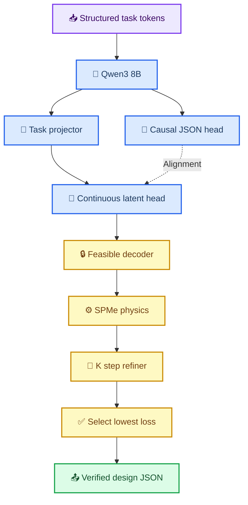
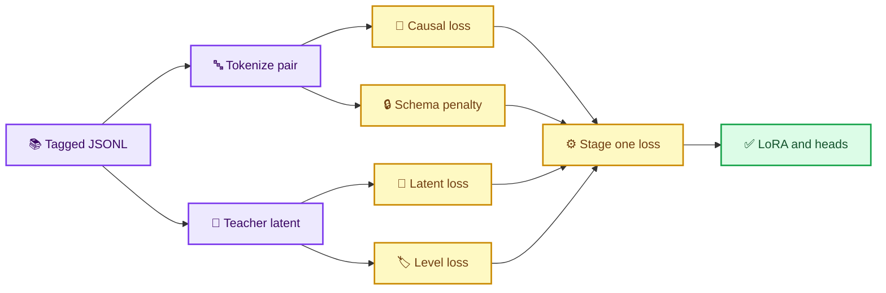

# GradCell-LM 三阶段代码分析报告

_面向 Qwen3-8B、结构化设计 JSON 与可微 PyBaMM 优化的实现说明，2026-09-07_

---

## 📋 报告摘要

GradCell-LM 在原有 GradCell 数值优化器上增加了语言模型入口。模型读取带领域标签的电芯
设计任务，通过 Qwen3-8B 形成任务表示，同时产生两类设计输出：自回归 JSON 用于结构化
表达，连续 latent 用于连接硬可行解码器和 PyBaMM 梯度。训练被明确拆成三个阶段：

| 阶段 | 主要目标 | 可训练部分 | 物理调用 |
| --- | --- | --- | --- |
| S1 | 理解标签并生成合格 JSON | Qwen LoRA、projector、设计 heads | 无 |
| S2 | 生成满足需求的 K=0 初始设计 | projector、continuous head | SPMe 1C/5C/6C |
| S3 | K=3 迭代并选择最佳设计 | physics refiner | 每个任务 K+1 轮 |

> 📌 上表描述当前已实现代码。下一版 S2 将把 K=0 从外部 `continuous_head` 迁移到 Qwen
> 五个 level-token logits，并用 PyBaMM 梯度训练 LoRA；下文单独记录目标架构与实现差异。

当前材料参数集固定为 `Chen2020`，温度固定为 `298.15 K`。因此本版本优化的是电芯结构，
不是正负极化学体系或电解液组成。最终 JSON 显式携带这一边界。

## 🏗️ 总体架构



系统保留两条并行输出路径是必要的：

- **语言路径**通过 Qwen 原生 causal LM 生成 JSON token，负责格式、字段语义和可读性
- **物理路径**通过连续 head 输出五维 latent，负责可微优化、硬约束和性能满足

离散采样和 JSON 解析无法对 PyBaMM 梯度求导。因此 S2/S3 的物理梯度走连续路径；最终
设计由连续路径解码、物理评价后重新序列化成同一 JSON schema。

## 🧾 输入任务表示

任务结构定义在 `src/gradcell/language/codec.py`。`StructuredPreferenceTask` 当前包含：

| 字段 | 含义 | 当前状态 |
| --- | --- | --- |
| `preference` | 能量与高倍率余量的权衡 | 动态输入 |
| `target_energy` | 1C 最低比能量 | 动态输入 |
| `min_retention_5c` | 5C 最低能量保持率 | 动态输入 |
| `min_retention_6c` | 6C 最低能量保持率 | 动态输入 |
| `temperature_k` | 运行温度 | 固定 `298.15 K` |
| `material_parameter_set` | PyBaMM 参数集 | 固定 `Chen2020` |

`GradCellLanguageCodec.serialize_task()` 将任务展开成四组领域标签：

```text
<TASK>
  <MATERIAL_CONTEXT>...</MATERIAL_CONTEXT>
  <OPERATING_CONDITION>...</OPERATING_CONDITION>
  <PERFORMANCE_REQUIREMENTS>...</PERFORMANCE_REQUIREMENTS>
  <PREFERENCE_PROFILE>...</PREFERENCE_PROFILE>
  <DESIGN_CONSTRAINTS>...</DESIGN_CONSTRAINTS>
  <OUTPUT_CONTRACT>...</OUTPUT_CONTRACT>
</TASK>
<DESIGN>
```

### 数值与语义标签并存

`preference` 同时表达为离散 level 和语义优先级。例如 `preference=0.70` 会得到：

```text
<PREFERENCE><LEVEL_178></PREFERENCE>
<ENERGY_PRIORITY>HIGH</ENERGY_PRIORITY>
<RATE_PRIORITY>LOW</RATE_PRIORITY>
```

level 保留连续顺序，`HIGH/MEDIUM/LOW` 帮助语言模型建立粗粒度语义。两者由确定性规则生成，
不会出现标签互相冲突。

### 固定上下文保护

`StructuredPreferenceTask.__post_init__()` 会拒绝非 `298.15 K` 或非 `Chen2020` 的任务。
这是刻意的安全边界：温度尚未注册为 PyBaMM `InputParameter`，材料体系也未开放为设计变量。

## 🗂️ 训练数据生成

入口为 `scripts/generate_language_design_data.py`，输出 JSONL。每条记录包含：

```json
{
  "id": "preference_000001",
  "preference": 0.7,
  "targets": [155.0, 0.5, 0.44],
  "task_text": "<TASK>...</TASK><DESIGN>",
  "teacher_latent": [0.1, 0.2, 0.3, 1.1, -0.7],
  "target_json": "{...}",
  "teacher_levels": [131, 134, 137, 163, 105]
}
```

### 两种教师来源

未提供 `--reference-front` 时，脚本使用已有 K=0 的 `task_encoder + initializer` 作为教师。
这种方式适合复现原 GradCell 的偏好映射，但显式性能目标基本固定。

提供 `--reference-front` 时，脚本执行更完整的目标条件化采样：

1. 从参考 Pareto 集随机选择一个可行 anchor
2. 在 anchor 性能下方采样目标，确保至少存在一个可行候选
3. 对前沿全部候选计算 goal-conditioned loss
4. 选择损失最低的 latent 作为当前任务的 oracle 标签
5. 将 oracle 解码为 canonical JSON

正式训练应始终提供 `--reference-front`，否则模型容易忽略新增的显式目标标签。

`LanguageDesignDataset` 位于 `src/gradcell/language/dataset.py`，负责逐行检查必需字段和五维
latent 长度，并将偏好、目标和 teacher latent 转为 Tensor。

## 🧠 Qwen 与双设计头

核心实现在 `src/gradcell/language/model.py`。

### QwenBackbone

`QwenBackbone` 延迟导入 Hugging Face 依赖，核心 GradCell 测试无需安装 8B 模型环境。
构造函数支持：

- BF16 全权重加载
- NF4 4-bit 双重量化
- LoRA `q_proj/k_proj/v_proj/o_proj`
- 已有 LoRA adapter 恢复
- 原生 causal forward 和 generation

A100 40GB 建议使用 BF16，不添加 `--load-in-4bit`。S1 训练 LoRA，S2/S3 默认冻结它。

### LanguageGradCell

`LanguageGradCell.encode()` 取最后一个非 padding token 的 hidden state，再通过 projector：

```text
Qwen hidden_size → 256 → task_dim 128
```

`propose()` 生成：

```text
continuous_latent: [B, 5]
level_logits:      [B, 5, 256]
token_latent:      [B, 5]
```

连续 head 使用 `4 * tanh(...)` 将 latent 控制在 `[-4,4]`。level head 对每个设计维度预测
256 个量化档位，并通过期望 level 构造可微 token latent。`token_blend` 可以混合连续与量化
路径，当前默认 `0.0`，即物理训练完全采用连续 head。

### 为什么输出 latent 而不是独立物理参数

五个 latent 经 `DesignSpace` 映射为：

| Latent | 解码参数 | 约束方式 |
| ---: | --- | --- |
| 0 | 正极孔隙率 | bounded sigmoid |
| 1 | 负极孔隙率 | bounded sigmoid |
| 2 | 隔膜孔隙率 | bounded sigmoid |
| 3 | 正极活性材料比例 | 耦合可行区间 |
| 4 | N/P 比 | bounded sigmoid |

负极活性材料比例由容量平衡解析推导。这样即使语言 head 的初始预测较差，也不会绕过
相体积分数、最小非活性相和 N/P 约束。

## 🧪 阶段一：JSON 语义训练

训练入口为 `scripts/train_language_stage1_semantic.py`。



总损失为：

\[
L_1=L_{causal}+w_sL_{schema}+w_lL_{latent}+w_qL_{level}+w_fL_{feasible}
\]

| 损失 | 代码含义 | 默认权重 |
| --- | --- | ---: |
| `L_causal` | 完整目标 JSON 的 teacher-forcing 交叉熵 | 1.0 |
| `L_schema` | 括号、引号、键名、冒号和逗号 token 的额外交叉熵 | 2.0 |
| `L_latent` | continuous latent 对 teacher latent 的 MSE | 1.0 |
| `L_level` | 五个量化 level 的分类损失 | 0.25 |
| `L_feasible` | 解码设计的边界与耦合约束惩罚 | 10.0 |

`shifted_cross_entropy()` 显式处理 causal LM 的一位预测偏移。`collate()` 将 prompt 部分和
padding 位置从语言标签中屏蔽，只监督 JSON 输出。

每个 epoch 后，脚本对验证任务执行 greedy generation，再使用
`MaterialDesignJSONCodec.loads()` 严格解析，报告 `validation_valid_json_rate`。这项指标是
非可微验收指标；训练中的可微替代是 `L_schema`。

S1 输出：

```text
stage1_s7/
├── qwen_adapter/
├── language_heads.pt
└── metrics.json
```

## ⚙️ 阶段二：K=0 物理训练

训练入口为 `scripts/train_language_stage2_k0_physics.py`，共享实现位于
`src/gradcell/language/physics_training.py`。

S2 加载 S1 adapter 与 heads，冻结 Qwen、LoRA、level head 和整个原 GradCell 参数，仅开放：

- `projector`
- `continuous_head`

每一步动态采样：

```text
preference      ∈ [0,1]
target_energy   ∈ [145,160] Wh/kg
min_R5          ∈ [0.48,0.55]
min_R6          ∈ [0.42,0.48]
```

任务被重新序列化为标签序列，连续 latent 经过 `DesignSpace` 后分别执行 1C、5C、6C SPMe。
`DifferentiablePhysicsLayer` 保存 PyBaMM sensitivity，并在 backward 中计算
`Jᵀ·dL/dV`，最终把物理梯度传回 projector 和 continuous head。

### Goal-conditioned objective

`src/gradcell/losses/goal_conditioned.py` 定义逐样本需求损失：

\[
L_{constraint}=\operatorname{ReLU}(E^*-E)/160
+5\operatorname{ReLU}(R_5^*-R_5)
+5\operatorname{ReLU}(R_6^*-R_6)
\]

满足最低要求后，模型仍按照 `preference` 优化比能量或倍率余量，避免所有 hinge 项归零后
失去梯度。S2 的 `refinement_steps=0`，因此输出即语言模型的一次 K=0 设计。

### 下一版：LLM 内嵌 K=0

目标实现不再把 Qwen 仅作为冻结编码器。Qwen 自回归输出固定的五个 level token；训练时
从每个位置的 256 档 logits 计算 softmax 期望 latent，经过 `DesignSpace` 和 PyBaMM 后，
物理 loss 反向更新 LoRA。推理阶段才执行 `argmax`，并由确定性序列化器生成最终 JSON。

| 项目 | 当前实现 | 目标实现 |
| --- | --- | --- |
| K=0 来源 | `continuous_head` | Qwen 五个 level logits |
| Qwen 基座 | 冻结 | 冻结 |
| 阶段一 LoRA | 冻结 | 训练 |
| `projector` | 训练 | 停用 |
| `continuous_head` | 训练 | 停用 |
| 物理梯度终点 | 外部 head | Qwen LoRA |
| JSON | 连续设计后序列化 | level latent 解码后序列化 |

目标损失为：

```text
L_stage2 = λ_token × L_level_CE
         + λ_physics × L_K0_physics
         + λ_entropy × L_level_entropy
```

该设计保留 token 监督，避免只用物理标量更新 LoRA 时破坏五维输出格式。实现完成前，现有
`train_language_stage2_k0_physics.py` 仍属于 legacy 外部 head 路径。

## 🔄 阶段三：K=3 迭代训练

入口为 `scripts/train_language_stage3_k3_refiner.py`。脚本先加载 S2 checkpoint，然后冻结：

- Qwen 与 LoRA
- projector 与 continuous head
- level head
- K=0 初始设计映射

仅 `gradcell.refiner` 保持可训练。每一步 refiner 接收：

```text
task embedding
current latent
energy relative to target
minimum retention margin
current physics loss
solver status
latent norm
normalized physics gradient
```

更新规则仍为：

\[
u_{k+1}=u_k-\alpha_kD_kg_k
\]

其中 `D_k` 为正对角预条件器，每一步 latent 更新继续受 L2 范数上限保护。

S3 不强制采用最后一步。`LanguageGradCell.forward()` 对每个样本堆叠 K+1 个 loss，保存
`best_step_index` 和 `best_latent`。训练目标为：

\[
L_3=\min_k L(u_k)+0.1L_{aux}+0.1L_{monotonic}+10^{-3}L_{step}
\]

这一设计允许中间步骤成为最佳候选，同时惩罚明显退化和过大的无效移动。

## 📄 JSON 生成与验证

`src/gradcell/language/json_design.py` 定义 canonical schema。核心字段包括：

```json
{
  "schema": "gradcell.material_design.v1",
  "material_parameter_set": "Chen2020",
  "fixed_material_properties": true,
  "design": {
    "positive_electrode_porosity": 0.3,
    "negative_electrode_porosity": 0.31,
    "separator_porosity": 0.45,
    "positive_active_material_fraction": 0.57,
    "negative_to_positive_capacity_ratio": 1.1
  },
  "derived": {
    "negative_active_material_fraction": 0.59,
    "nominal_capacity_ah": 4.8,
    "stack_mass_kg": 0.09
  }
}
```

`MaterialDesignJSONCodec.loads()` 不只是调用 `json.loads()`，还检查：

- schema 名称
- 字段完整性与顺序
- 三个孔隙率范围
- N/P 比范围
- 正极活性材料比例的耦合上限
- 负极容量平衡对应的可行区间

`LanguageGradCell.render_best_json()` 在正式输出中进一步加入：

- `selected_refinement_step`
- 1C 比能量
- 5C/6C 能量保持率
- physics loss
- solver success
- 用户需求原值
- `requirements_satisfied`

`requirements_satisfied=true` 仅在求解成功且三个显式性能要求全部满足时返回。

## 💾 检查点衔接

| 文件 | 写入阶段 | 读取阶段 | 内容 |
| --- | --- | --- | --- |
| `qwen_adapter/` | S1 | S2/S3 | Qwen LoRA |
| `language_heads.pt` | S1 | S2/S3 | projector、continuous/level heads |
| `stage2_k0_s7.pt` | S2 | S3/推理 | heads、GradCell状态、训练历史 |
| `stage3_k3_s7.pt` | S3 | 推理 | refiner、heads、GradCell状态 |

`load_language_model()` 先恢复 Qwen adapter，再加载三类 head；`load_physics_checkpoint()`
恢复 S2/S3 中的小型连续模块。8B 基座权重不重复写入每个物理 checkpoint。

## 🚀 A100 40GB 运行方式

安装环境：

```bash
bash scripts/setup_language_gpu.sh
export PYTHONPATH="$PWD/src"
export CUDA_VISIBLE_DEVICES=0
export TOKENIZERS_PARALLELISM=false
```

A100 40GB 直接使用 BF16，不传 `--load-in-4bit`。建议分阶段运行，便于检查中间产物。

### S1

```bash
python scripts/generate_language_design_data.py \
  --checkpoint results/gradcell_exploration/k0_s7/model.pt \
  --reference-front results/gradcell_exploration/reference/pareto_front_1c5c6c.npz \
  --samples 4096 \
  --output data/gradcell_lm/k0_distillation_s7.jsonl

python scripts/train_language_stage1_semantic.py \
  --data data/gradcell_lm/k0_distillation_s7.jsonl \
  --output-dir results/gradcell_lm/stage1_s7 \
  --batch-size 2 --gradient-accumulation 8 --epochs 3
```

### S2

```bash
python scripts/train_language_stage2_k0_physics.py \
  --stage1-dir results/gradcell_lm/stage1_s7 \
  --reference-front results/gradcell_exploration/reference/pareto_front_1c5c6c.npz \
  --output results/gradcell_lm/stage2_k0_s7.pt \
  --backend pybamm --physics-model SPMe \
  --steps 1000 --batch-size 1
```

### S3

```bash
python scripts/train_language_stage3_k3_refiner.py \
  --stage1-dir results/gradcell_lm/stage1_s7 \
  --stage2-checkpoint results/gradcell_lm/stage2_k0_s7.pt \
  --reference-front results/gradcell_exploration/reference/pareto_front_1c5c6c.npz \
  --output results/gradcell_lm/stage3_k3_s7.pt \
  --backend pybamm --physics-model SPMe \
  --steps 300 --refinement-steps 3
```

### 最终设计

```bash
python scripts/generate_language_material_design.py \
  --stage1-dir results/gradcell_lm/stage1_s7 \
  --checkpoint results/gradcell_lm/stage3_k3_s7.pt \
  --reference-front results/gradcell_exploration/reference/pareto_front_1c5c6c.npz \
  --preference 0.70 --target-energy 155 \
  --min-retention-5c 0.50 --min-retention-6c 0.44 \
  --refinement-steps 3 --backend pybamm
```

## ⚠️ 当前实现边界与风险

### 材料设计命名边界

JSON schema 名称为 `material_design`，但当前输出变量全部是结构参数。`Chen2020` 的固相
扩散率、反应动力学、电解液性质和材料组成仍固定。论文中应使用“固定材料体系下的结构
逆向设计”，不能表述为发现新材料。

### S1 可行性惩罚的作用

continuous latent 先经过硬可行 decoder，因此 `L_feasible` 正常情况下应接近零。S1 中真正
约束自由文本 JSON 格式的是 `L_schema`；自由生成结果是否合格最终由严格解析率衡量。

### 任务采样范围

S2 当前使用手工保守范围。即使范围看似合理，联合目标仍可能不可行。正式实验应从参考集
构造目标可达域，并单独标记不可行任务，避免把不可达需求当作训练失败。

### 算力分配

Qwen 位于 GPU，PyBaMM 通常仍在 CPU 单样本求解。S2/S3 的主要瓶颈可能是物理求解而非
A100 算力。盲目增加语言 batch size 不会同比提高 PyBaMM 吞吐量。

### JSON 与连续 head 一致性

当前 S1 同时监督两条路径，但 S2 只更新 continuous head 和 projector，可能导致 S1 原始
自回归 JSON 与 S2 最优设计发生偏移。正式输出通过重新序列化连续设计解决正确性问题，
后续可增加周期性 JSON consistency 蒸馏来保持两条路径语义同步。

### 验证层次

SPMe 训练成功仅表明模型在当前近似物理域内有效。候选还需要 hard-cutoff SPMe 评价、DFN
复核以及未来的实验数据验证。

## ✅ 建议验收矩阵

| 层次 | S1 | S2 | S3 |
| --- | --- | --- | --- |
| 格式 | JSON解析率 | 最终JSON一致性 | 最佳JSON一致性 |
| 结构 | 硬可行率 | 硬可行率 | 全步骤硬可行率 |
| 物理 | 不适用 | K=0成功率/regret | K=3改善率/regret |
| 泛化 | held-out目标标签 | 离网格任务 | 离网格最佳step |
| 对照 | 无schema惩罚 | 原MLP K=0 | 原refiner/exact gradient |

推荐至少运行 `seed=7,17,27`，并固定同一 reference front、任务集合和物理调用预算。核心结论
应同时报告均值、标准差、失败率和需求满足率，不能只展示一个成功 JSON。

## 📚 文件导航

| 文件 | 主要职责 |
| --- | --- |
| `src/gradcell/language/codec.py` | 任务标签与 latent level 编解码 |
| `src/gradcell/language/json_design.py` | JSON序列化、解析与严格验证 |
| `src/gradcell/language/model.py` | Qwen、双head、K步选择与最终JSON |
| `src/gradcell/language/dataset.py` | JSONL训练数据读取 |
| `src/gradcell/language/physics_training.py` | S2/S3共享构建、采样、训练和checkpoint |
| `src/gradcell/losses/goal_conditioned.py` | 显式用户需求loss |
| `src/gradcell/models/gradcell.py` | 外部embedding入口、物理评价与refiner |
| `scripts/generate_language_design_data.py` | 生成目标条件化S1数据 |
| `scripts/train_language_stage1_semantic.py` | JSON语义训练 |
| `scripts/train_language_stage2_k0_physics.py` | K=0物理训练 |
| `scripts/train_language_stage3_k3_refiner.py` | K=3迭代训练 |
| `scripts/generate_language_material_design.py` | 输出最佳物理验证JSON |
| `scripts/run_language_three_stage.sh` | 三阶段服务器编排 |

## 🎯 结论

当前代码已经形成完整的“语言任务理解—结构化生成—可微物理优化—严格JSON输出”框架。
S1 解决语言格式和语义，S2 解决一次性需求满足，S3 解决有限物理预算下的迭代改进。

框架最重要的设计原则是：语言模型负责表达和条件化，硬解码器负责结构可行性，PyBaMM
负责物理性能，refiner负责有限步改进。四者职责分离，使每个实验阶段都能单独验收和消融。
