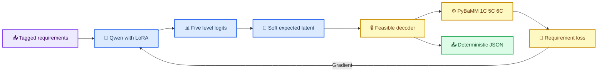

# GradCell-LM 阶段二：K=0 可微物理训练

_目标方案：Qwen 直接输出五个 K=0 latent token，并由 PyBaMM 物理损失微调 LoRA。本文先定义目标架构；当前代码仍是外部 continuous head 实现。_

---

## 🎯 目标

阶段二加载阶段一的 Qwen LoRA，让 Qwen 在输出序列中直接预测五个量化 K=0 latent token。
训练时不对 token 执行不可导的 `argmax`，而是从 256 档 logits 计算连续期望 latent，送入
GradCell 硬可行解码器与 1C、5C、6C PyBaMM-SPMe。物理 loss 沿这条软解码路径反向更新
Qwen LoRA。

本阶段对应原GradCell initializer的K=0：每个任务只提出一个设计，不执行refiner。

## 🔗 输出表示

Qwen 只输出五个 latent，不自由生成带附加字段的 JSON：

```text
<DESIGN>
<U0><LEVEL_132></U0>
<U1><LEVEL_087></U1>
<U2><LEVEL_201></U2>
<U3><LEVEL_156></U3>
<U4><LEVEL_104></U4>
</DESIGN>
```

| Token | K=0 设计维度 |
| --- | --- |
| `U0` | 正极孔隙率 latent |
| `U1` | 负极孔隙率 latent |
| `U2` | 隔膜孔隙率 latent |
| `U3` | 正极活性材料比例 latent |
| `U4` | 负极/正极容量比 latent |

最终材料设计 JSON 由 `DesignSpace` 解码结果确定性序列化，不允许语言模型自行添加
`physics_loss`、内部字段名或其他说明文字。

## 🔄 可微路径



对第 `i` 个设计维度，令 Qwen 在 256 个 level token 上输出 `z_i`：

```text
p_i = softmax(z_i / temperature)
u_i = Σ_j p_i,j × level_value_j
```

训练使用连续的 `u_i` 接收物理梯度；推理才使用 `argmax(z_i)` 得到离散 token。

## 🔒 训练与冻结策略

| 模块 | 状态 | 原因 |
| --- | --- | --- |
| Qwen3-8B 基座 | 冻结 | 控制显存并保留通用语义能力 |
| 阶段一 LoRA | 训练 | 将 K=0 物理反馈嵌入 LLM 输出分布 |
| Level token embedding / LM head | 训练 | 学习五个 latent token |
| `projector` / `continuous_head` | 停用 | K=0 不再由外部 head 产生 |
| GradCell 可行域解码器 | 冻结 | 固定设计变量到物理参数的映射 |
| K=3 refiner | 冻结 | 留到阶段三训练 |
| PyBaMM | 无权重 | 提供 forward sensitivity 与 `Jᵀv` |

## 🧮 损失函数

```text
L_stage2 = 1.0 × L_level_CE
         + 0.1 × L_K0_physics
         + 0.001 × L_level_entropy
```

- `L_level_CE`：保持五个 token 接近 K=0 teacher，防止物理训练初期漂移
- `L_K0_physics`：根据目标能量、5C/6C 保持率和用户偏好计算
- `L_level_entropy`：促使每个维度形成清晰的 level 分布

物理权重应从较小值开始，确认求解稳定后再逐步增加。为了防止阶段一能力遗忘，阶段二仍需
回放 level-token 监督，不能只依赖单个物理标量。

## 📍 实现状态

> ⚠️ 当前 `scripts/train_language_stage2_k0_physics.py` 仍冻结 Qwen/LoRA，并训练
> `projector + continuous_head`。上面的 LLM 内嵌 K=0 是下一版目标，完成代码迁移前，
> 下面的现有命令只能运行 legacy 路径。

## 🖥️ 当前 legacy 命令

```bash
python scripts/train_language_stage2_k0_physics.py \
  --stage1-dir results/gradcell_lm/stage1_s7 \
  --reference-front results/gradcell_exploration/reference/pareto_front_1c5c6c.npz \
  --output results/gradcell_lm/stage2_k0_s7.pt \
  --backend pybamm --physics-model SPMe --load-in-4bit \
  --steps 1000 --batch-size 1
```

## 🚀 A100 40GB运行指令

本阶段Qwen和LoRA冻结，A100直接使用BF16，不传`--load-in-4bit`。PyBaMM通常运行在CPU，
因此建议先检查CPU核心数和内存：

```bash
cd grad_cell
source .venv/bin/activate
export PYTHONPATH="$PWD/src"
export CUDA_VISIBLE_DEVICES=0
export TOKENIZERS_PARALLELISM=false

nvidia-smi
lscpu | head -n 20
free -h
```

检查S1输入和参考前沿：

```bash
test -d results/gradcell_lm/stage1_s7/qwen_adapter
test -f results/gradcell_lm/stage1_s7/language_heads.pt
test -f results/gradcell_exploration/reference/pareto_front_1c5c6c.npz
mkdir -p results/gradcell_lm/logs
```

建议先运行10步SPMe短任务，确认PyBaMM反向链和checkpoint写入正常：

```bash
python scripts/train_language_stage2_k0_physics.py \
  --stage1-dir results/gradcell_lm/stage1_s7 \
  --reference-front results/gradcell_exploration/reference/pareto_front_1c5c6c.npz \
  --output results/gradcell_lm/stage2_k0_smoke_s7.pt \
  --backend pybamm --physics-model SPMe \
  --steps 10 --batch-size 1 --learning-rate 3e-5 \
  --validation-interval 5
```

短任务通过后启动正式S2：

```bash
nohup python scripts/train_language_stage2_k0_physics.py \
  --stage1-dir results/gradcell_lm/stage1_s7 \
  --reference-front results/gradcell_exploration/reference/pareto_front_1c5c6c.npz \
  --output results/gradcell_lm/stage2_k0_s7.pt \
  --backend pybamm --physics-model SPMe \
  --steps 1000 --batch-size 1 --learning-rate 3e-5 \
  --validation-interval 25 \
  > results/gradcell_lm/logs/stage2_k0_s7.log 2>&1 &

echo $! > results/gradcell_lm/logs/stage2_k0_s7.pid
tail -f results/gradcell_lm/logs/stage2_k0_s7.log
```

运行中同时观察GPU和进程：

```bash
watch -n 2 nvidia-smi
ps -fp "$(cat results/gradcell_lm/logs/stage2_k0_s7.pid)"
```

完成后检查checkpoint：

```bash
test -s results/gradcell_lm/stage2_k0_s7.pt
ls -lh results/gradcell_lm/stage2_k0_s7.pt
tail -n 20 results/gradcell_lm/logs/stage2_k0_s7.log
```

## ✅ 验收与对照

- 三倍率求解成功率和硬约束满足率；
- 21点及离网格偏好的scalarized regret；
- 与原Fourier-MLP K=0、阶段一未物理微调模型、随机设计比较；
- preference到能量/保持率的单调性；
- DFN只用于最终复核，不能用于训练结论替代真实数据。
- 五个 level token 的格式正确率、逐维准确率与 latent MAE；
- 物理 loss 是否能对 LoRA 参数产生非零有限梯度；
- LLM 内嵌 K=0 与 legacy `continuous_head` K=0 的公平对照。
