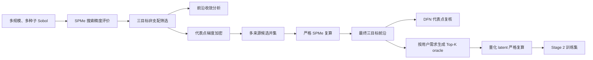

# GradCell-LM 高可信三目标前沿与 Stage 2 Oracle 生成

*目标：建立可追溯、可复算、可量化验真的三目标设计档案，为 Qwen3-8B 第二阶段训练提供可信监督标签。*

---

## 🧭 总体流程



这里的“高可信”不是数学意义上的全局最优证明，而是指：搜索覆盖充分、前沿随预算趋于稳定、所有候选使用统一物理定义复算、代表点经过更高保真模型交叉验证，并且训练实际使用的离散 latent 也经过重新仿真。

---

## 🧱 固定实验定义

所有阶段必须保持以下配置一致：

- 参数集：`Chen2020`
- 搜索模型：`SPMe`
- 复核模型：`DFN`
- 目标：最大化 `E1`、`R5`、`R6`
- latent 维数：5
- latent 范围：`[-4, 4]`
- 容量公式：`chen2020_scaled`
- 搜索精度：`rtol=1e-6`、`atol=1e-8`、151 个时间点
- 严格复算：`rtol=1e-8`、`atol=1e-10`、301 个时间点

任何容量公式、质量计算、截止电压或倍率定义的变化都会使新旧结果失去直接可比性，因此脚本会把这些设置写入 NPZ 元数据或 JSON provenance。

---

## 🌐 第一步：Sobol 全局覆盖

该步骤主要使用 CPU；A100 不会显著加速 PyBaMM 求解。建议先用单个种子跑通 8192 点，再扩展到三个种子和 32768/65536 点。

```bash
cd /data/yuwj/zhanghaoyu/grad_cell
conda activate grad_cell
export PYTHONPATH="$PWD/src:${PYTHONPATH:-}"

python scripts/generate_supervised_data.py \
  --backend pybamm \
  --model SPMe \
  --sampler sobol \
  --samples 32768 \
  --latent-limit 4 \
  --seed 7 \
  --time-points 151 \
  --capacity-formula chen2020_scaled \
  --output data/high_confidence/sobol_32768_s7.npz
```

分别将 `--samples` 设置为 `8192`、`16384`、`32768`，将 `--seed` 设置为 `7`、`17`、`27`。相同种子的 Sobol 序列具有嵌套前缀性质，适合观察采样预算增加后的收敛变化。

如计算预算允许，再增加：

```bash
--samples 65536
```

---

## 📐 第二步：构建三目标前沿

每个原始 archive 分别构建前沿，不要提前把 `R5` 和 `R6` 合并成 `min(R5,R6)`。

```bash
python scripts/build_reference_front_3d.py \
  --data data/high_confidence/sobol_32768_s7.npz \
  --output data/high_confidence/front_32768_s7.npz \
  --capacity-formula chen2020_scaled
```

脚本输出：

- 五维 `latent`
- 五个可解释设计量组成的 `design`
- `energy_wh_kg`
- `energy_retention_5c`
- `energy_retention_6c`
- 来源 archive 和候选索引
- 完整 provenance

这里得到的是有限预算下的经验 Pareto 前沿。

---

## 📊 第三步：检查前沿稳定性

```bash
python scripts/analyze_front_convergence.py \
  --fronts \
    data/high_confidence/front_8192_s7.npz \
    data/high_confidence/front_16384_s7.npz \
    data/high_confidence/front_32768_s7.npz \
  --labels N8192 N16384 N32768 \
  --output results/high_confidence/convergence_s7.json
```

报告包含：

- 三维 Hypervolume 及相邻预算的相对变化
- Generational Distance
- Inverted Generational Distance
- Hausdorff distance
- 三个目标极值的变化

建议最终两级的相对 Hypervolume 变化低于 1%，并同时比较种子 7、17、27。Hypervolume 稳定但 Hausdorff distance 很大时，仍说明局部前沿尚不稳定。

---

## 🔬 第四步：前沿局部加密

从极端区域、膝区和均匀权重方向选择代表点，直接优化 latent；GradCell 网络参数在这里不参与训练。

```bash
python scripts/refine_front_candidates.py \
  --front data/high_confidence/front_32768_s7.npz \
  --output data/high_confidence/refined_adam_s7.npz \
  --representatives 100 \
  --steps 100 \
  --learning-rate 0.01 \
  --capacity-formula chen2020_scaled \
  --capacity-multiplier 1.0 \
  --seed 7
```

该脚本通过可微 SPMe sensitivity 执行 Adam 加密，并对最终点进行硬截止评价。若另有 CMA-ES、Bayesian Optimization 或外部求解器结果，只需输出同一 NPZ 协议：`latent`、`energy_wh_kg`、`energy_retention_5c`、`energy_retention_6c`、`metadata`，即可在下一步统一合并。

---

## 🔗 第五步：多来源并集与严格 SPMe 复算

先合并不同种子、不同预算和不同优化算法的候选：

```bash
python scripts/build_reference_front_3d.py \
  --data \
    data/high_confidence/front_32768_s7.npz \
    data/high_confidence/front_32768_s17.npz \
    data/high_confidence/front_32768_s27.npz \
    data/high_confidence/refined_adam_s7.npz \
    data/high_confidence/refined_adam_s17.npz \
    data/high_confidence/refined_adam_s27.npz \
  --output data/high_confidence/front_merged_search_precision.npz \
  --capacity-formula chen2020_scaled
```

然后以严格容差复算合并候选：

```bash
python scripts/reevaluate_front_candidates.py \
  --input data/high_confidence/front_merged_search_precision.npz \
  --output data/high_confidence/strict_candidates_spme.npz \
  --model SPMe \
  --time-points 301 \
  --rtol 1e-8 \
  --atol 1e-10 \
  --batch-size 8 \
  --capacity-formula chen2020_scaled

python scripts/build_reference_front_3d.py \
  --data data/high_confidence/strict_candidates_spme.npz \
  --output data/high_confidence/pareto_front_1c_r5_r6_strict.npz \
  --capacity-formula chen2020_scaled
```

必须在严格复算后再次执行非支配排序，因为容差变化可能改变点之间的支配关系。

---

## ✅ 第六步：DFN 复核

```bash
python scripts/verify_front_dfn.py \
  --front data/high_confidence/pareto_front_1c_r5_r6_strict.npz \
  --output-dir results/high_confidence/dfn_verification \
  --max-candidates 100 \
  --time-points 301 \
  --rtol 1e-8 \
  --atol 1e-10 \
  --retention-5c-min 0.50 \
  --retention-6c-min 0.44 \
  --capacity-formula chen2020_scaled
```

`metrics.json` 会报告 SPMe 与 DFN 的目标相对误差、Spearman 排序相关性、求解成功率和约束满足一致率。若 DFN 成功率或约束一致率明显偏低，应停止生成训练标签，先检查模型定义与前沿边界。

---

## 🧠 第七步：生成用户条件 Top-K Oracle

```bash
python scripts/generate_stage2_oracle_data.py \
  --front data/high_confidence/pareto_front_1c_r5_r6_strict.npz \
  --output-dir data/gradcell_lm/stage2_oracle_unverified_s7 \
  --tasks 4096 \
  --top-k 3 \
  --bins 256 \
  --capacity-formula chen2020_scaled \
  --capacity-multiplier 1.0 \
  --seed 7
```

每条任务先选取一个前沿 anchor，再从 anchor 性能向内采样可满足的能量与倍率要求。全局前沿按“约束违反优先、偏好奖励其次”排序，保留 Top-K oracle。数据划分按 anchor 哈希完成，避免同一 anchor 同时出现在训练集和验证集。

此目录暂时不能直接称为 physics-verified，因为 `<LEVEL_*>` 量化会改变连续 latent。

---

## 🛡️ 第八步：复算实际训练标签

```bash
python scripts/verify_stage2_oracle_quantization.py \
  --input-dir data/gradcell_lm/stage2_oracle_unverified_s7 \
  --output-dir data/gradcell_lm/stage2_oracle_verified_s7 \
  --model SPMe \
  --time-points 301 \
  --rtol 1e-8 \
  --atol 1e-10 \
  --batch-size 8 \
  --capacity-formula chen2020_scaled \
  --require-feasible
```

该脚本会：

1. 去重所有 Top-K 量化 latent；
2. 对准确的量化值执行严格 SPMe；
3. 删除求解失败或不满足用户硬约束的候选；
4. 按复算结果重新排序 Top-K；
5. 重写主标签和设计文本；
6. 删除没有任何可行 oracle 的任务；
7. 输出 `verification_summary.json`。

第二阶段只应使用 `stage2_oracle_verified_s7`。建议重点检查：记录保留率、候选可行率、各 split 数量，以及不同 seed 数据的性能分布。

---

## 🚦进入第二阶段训练前的验收条件

建议同时满足以下条件：

- 最终两级采样规模的 Hypervolume 相对变化小于 1%；
- 三个随机种子的前沿极值和距离指标接近；
- 严格 SPMe 复算成功率接近 100%；
- DFN 代表点求解成功率、排序相关性和约束一致率达到项目设定阈值；
- 量化 oracle 已严格复算，训练集中不存在失败或违反硬约束的主标签；
- train、validation、test 不共享同一 anchor；
- 所有数据保留源 front、求解设置、容量公式、量化 bins 和 seed。

只有 JSON 合法率为 100% 只能说明第一阶段语法训练通过，不能替代上述物理标签验收。

---

## 🗂️ 新增脚本职责

| 脚本 | 职责 |
|---|---|
| `generate_supervised_data.py` | 新增 Sobol 与 latent 范围参数，生成全局物理评价 archive |
| `build_reference_front_3d.py` | 合并 archive 并构建 E1/R5/R6 三目标非支配前沿 |
| `analyze_front_convergence.py` | 计算 Hypervolume、GD、IGD、Hausdorff 和极值变化 |
| `refine_front_candidates.py` | 选择代表权重方向，利用可微 SPMe 对 latent 做 Adam 加密 |
| `reevaluate_front_candidates.py` | 使用统一严格容差重新计算候选性能 |
| `verify_front_dfn.py` | 对代表性 SPMe 前沿点执行 DFN 交叉验证 |
| `generate_stage2_oracle_data.py` | 从严格全局前沿生成用户条件 Top-K oracle |
| `verify_stage2_oracle_quantization.py` | 复算实际离散标签并清除失败或不可行监督样本 |

该流水线将“前沿搜索质量”和“Qwen 学习质量”分开评估：前者由收敛性、严格复算和 DFN 复核保证，后者再由 Stage 2 的任务满足率、oracle regret 和生成稳定性验收。
