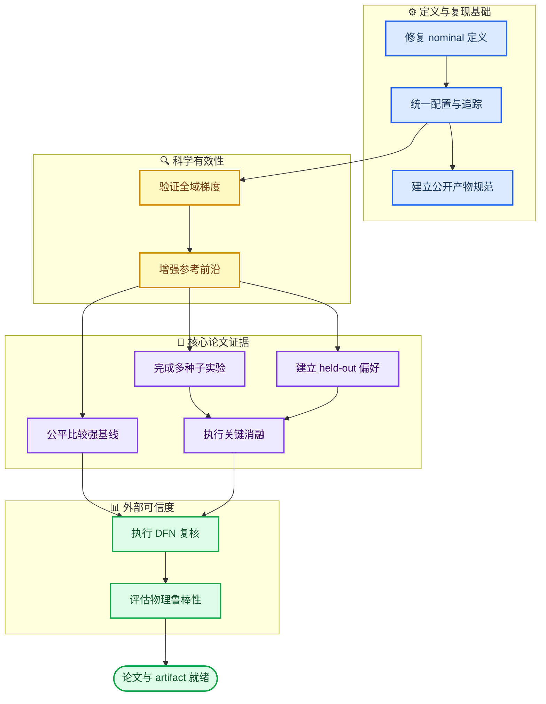

# GradCell 论文发表补强路线图

_面向 GradCell 方法论文的代码整改、实验设计、证据标准与公开复现计划，更新于 2026-09-06_

---

## 📋 文档目标

本文档把 GradCell 从“可运行的研究原型”推进到“可投稿、可审查、可复现的方法论文”。核心任务不是简单增加训练轮数，而是建立一条完整证据链：先保证定义和梯度正确，再建立可信参考前沿，随后完成公平基线、多随机种子、泛化、消融、跨模型验证与鲁棒性实验，最后公开数据和运行环境。

论文主问题建议限定为：在固定 Chen2020 材料体系和受约束的五维电芯结构空间中，能否利用可微 PyBaMM-SPMe 训练一个偏好条件化的摊销优化器，使其根据能量—高倍率性能偏好快速输出可行设计，并通过有限步 learned refinement 进一步接近参考 Pareto 前沿。

> ⚠️ **范围约束：** 当前电解液性质预测属于另一条研究线，不建议与本论文主实验混合。当前论文也不应声称发现了真实全局最优电芯，而应聚焦于摊销多目标优化的质量、速度、泛化和物理一致性。

### 当前证据基线

| 模型 | SPMe成功率 | 约束满足率 | 平均regret | 中位regret | 解释边界 |
| --- | ---: | ---: | ---: | ---: | --- |
| K=0 | 1.0000 | 1.0000 | 0.006311 | 0.001241 | 单一seed、同模型评价 |
| K=3 staged | 1.0000 | 1.0000 | 0.004209 | -0.000138 | 相对K=0平均下降约33.3% |

负 regret 不表示超越数学意义上的全局最优，只表示候选优于有限随机样本构成的离散 oracle。这正是参考前沿必须增强的原因。

## 🎯 总体实施原则

十项任务存在明确依赖关系。应先修复定义、配置和记录体系，再进行昂贵仿真。推荐流程如下。



整个计划采用四条共同规则。第一，所有方法必须在同一设计域、目标函数和 hard-cutoff 评价口径下比较。第二，模型选择所用数据与最终测试数据必须隔离。第三，所有结论必须同时给出中心趋势、最坏情况、置信区间和失败样本。第四，在前一阶段验收失败时，应先修复原因，而不是继续扩大后续实验。

## 🔧 第一阶段：定义、配置与结果追踪

### 1. 修复 nominal 定义

#### 当前问题

当前 `evaluate_gradcell.py` 将全零 latent 解码后的设计称为 nominal。由于 sigmoid 会把变量映射到边界中点，这个设计不等于 Chen2020 参数集中的原始标称设计。因此，“候选优于 nominal”目前只能解释为优于 latent 中心设计，不能解释为优于 Chen2020 标称电芯。

#### 建议方案

应同时保留两个明确命名的基线。

| 基线名称 | 定义 | 用途 |
| --- | --- | --- |
| `latent_center` | 五维 latent 全零后解码 | 检查网络是否优于搜索域中心 |
| `chen2020_nominal` | 直接读取 Chen2020 原始孔隙率、活性材料比例、容量和质量参数 | 检查是否优于真实物理参数基准 |

`chen2020_nominal` 最好绕过 latent 解码器直接进入物理评价，避免为了得到一个并不存在的精确逆映射而引入误差。同时计算该设计是否位于当前可行设计域；若不在，应报告超出哪些边界，而不是强行裁剪。如果论文还需要“可表示的 Chen2020 基线”，可额外求解一个最小参数距离投影，并命名为 `chen2020_projected`。

#### 代码改动

- 新增 `src/gradcell/benchmark/nominal.py`
- 定义 `build_latent_center()`、`build_chen2020_nominal()` 和 `project_nominal_to_design_space()`
- 修改 `scripts/evaluate_gradcell.py`，同时输出三种基线的物理指标和 Loss
- 在结果中保存完整设计参数，而不只保存 latent
- 对 nominal 的参数来源、单位和 PyBaMM 版本写入 metadata

#### 验收标准

- `chen2020_nominal` 的参数与指定 PyBaMM 版本读取值逐项一致
- 同一 nominal 在独立脚本和统一评价器中的1C、5C、6C结果一致
- 报告不再使用无定义的 `candidate_beats_nominal_fraction`
- 改为分别报告 `beats_latent_center_fraction` 和 `beats_chen2020_nominal_fraction`

#### 已实现的测试入口

仓库已增加 `scripts/evaluate_physical_nominal_baseline.py`。脚本直接读取 PyBaMM
`Chen2020` 的原始孔隙率、活性材料体积分数和标称容量，不经过 GradCell latent
解码器；候选、物理基线和旧的 latent 中心基线随后使用同一套0.1C容量校准、
1C/5C/6C hard-cutoff仿真、stack-mass proxy和标量化 Loss。

```bash
python scripts/evaluate_physical_nominal_baseline.py \
  --checkpoint results/gradcell_exploration_k0_preserved/k0_s7/model.pt \
  --reference-front results/gradcell_exploration_k0_preserved/reference/pareto_front_1c5c6c.npz \
  --evaluation-model SPMe \
  --refinement-steps 0 \
  --preference-points 21 \
  --output-dir results/gradcell_exploration_k0_preserved/evaluation/k0_vs_physical_nominal
```

核心输出为 `candidate_beats_physical_baseline_fraction`。`metrics.json` 同时明确记录该
基线是 PyBaMM 参数集物理基线而非实验测量，并检查 Chen2020 原始体积分数是否满足
当前 GradCell 搜索域的直接约束。

### 2. 统一配置

#### 当前问题

当前 YAML、命令行默认值和脚本硬编码并不完全一致。例如，`configs/physics/spme.yaml` 仍保留旧的1C/3C时域，而主实验已经使用1C/5C/6C。若论文表格中的结果无法唯一对应到一份配置，外部研究者很难复现。

#### 建议方案

建立单一配置入口，代码中的默认值只负责最小安全兜底，正式实验必须加载版本化 YAML。建议配置分成以下部分：

```text
configs/paper/
├── base.yaml
├── reference_spme.yaml
├── train_k0.yaml
├── train_k3.yaml
├── heldout_lambda.yaml
├── baselines.yaml
├── verify_dfn.yaml
└── robustness.yaml
```

每次运行必须将合并后的最终配置复制到结果目录，不能只记录用户传入的命令行参数。配置至少覆盖设计边界、参数集、C-rate、时域、网格点、求解器误差、soft gate、Loss、训练步数、batch size、seed、checkpoint选择规则和硬截止评价规则。

### 3. 完善结果追踪

每次运行生成不可变的 `run_manifest.json`，建议包含：

| 字段组 | 必须记录的内容 |
| --- | --- |
| 身份 | `run_id`、时间、实验名称、父实验 |
| 代码 | Git commit、dirty状态、Python版本 |
| 环境 | PyTorch、PyBaMM、NumPy、SUNDIALS版本 |
| 硬件 | CPU、GPU、内存、线程数 |
| 随机性 | 数据seed、模型seed、优化器seed |
| 方法 | 完整解析后配置、参数量、checkpoint |
| 成本 | wall time、CPU time、物理求解次数、失败次数 |
| 产物 | 文件路径、大小、SHA-256校验值 |

推荐将所有指标以逐样本长表保存。聚合 JSON 方便阅读，但不能替代逐 λ、逐 seed、逐候选原始结果。

#### 阶段验收门槛

只有满足下列条件，才开始大规模物理实验：

- 配置、CLI和实际构建对象完全一致
- 运行目录不再覆盖历史实验
- 每个结果都能追溯到 Git commit 与完整配置
- nominal、候选和 oracle 使用相同评价口径
- 单元测试和最小物理 smoke test 由 CI 自动运行

## 🔍 第二阶段：梯度与参考前沿可信度

### 4. 做全设计域梯度有限差分验证

#### 为什么必须做

当前梯度验证主要证明自定义 autograd 接口能够工作，但论文需要证明最终科学目标对设计变量的梯度在大部分设计域内方向正确。尤其是 soft voltage gate、μin(R5,R6)、求解失败边界和 sigmoid 饱和都可能使梯度不稳定。

#### 采样设计

建议使用分层样本，而不是只验证 nominal 附近。

| 区域 | 建议样本数 | 目的 |
| --- | ---: | --- |
| latent中心区域 | 30 | 验证常规梯度 |
| 接近每个变量上下边界 | 40 | 检查饱和和边界梯度 |
| Pareto候选附近 | 30 | 检查论文实际使用区域 |
| 截止或求解失败附近 | 20以上 | 分析非光滑和恢复策略 |

对每个样本分别验证1C、5C、6C电压轨迹方向导数、各性能指标梯度和最终标量化 Loss 梯度。有限差分步长至少扫描 (10^{-2},10^{-3},10^{-4},10^{-5})，避免单一步长下的数值巧合。

对于连续可微区域，建议报告：

\[
e_{\mathrm{rel}}
=
\frac{|g_{\mathrm{sens}}-g_{\mathrm{FD}}|}
{\max(|g_{\mathrm{sens}}|,|g_{\mathrm{FD}}|,\epsilon)}
\]

同时报告梯度方向余弦相似度：

\[
\cos(\theta)=
\frac{\nabla L_{\mathrm{sens}}^\top\nabla L_{\mathrm{FD}}}
{\|\nabla L_{\mathrm{sens}}\|_2\|\nabla L_{\mathrm{FD}}\|_2}
\]

#### 建议验收标准

以下阈值可作为第一版默认门槛，最终应根据求解器精度实验确定：

- 连续区域中位相对误差不高于 `1e-2`
- 95%样本方向余弦相似度不低于 `0.99`
- 不允许出现未解释的系统性符号反转
- 非光滑点单独分类，不混入连续区域平均值
- 梯度下降一步后，hard-cutoff Loss 改善比例应显著高于随机方向

#### 输出产物

```text
results/paper/gradient_validation/
├── samples.npz
├── coordinate_checks.csv
├── directional_checks.csv
├── step_size_sweep.csv
├── failure_cases.json
└── summary.json
```

### 5. 增强参考 Pareto 前沿

#### 当前问题

当前参考前沿由5000个高斯 latent 随机样本筛选得到。高斯采样会集中在中心区域，对五维有界空间边缘覆盖不足；有限前沿还会造成负 regret 和 oracle 不稳定。

#### 推荐的组合式 oracle

参考前沿不应只依赖一种优化方法。建议合并四类候选：

1. Sobol或Latin hypercube全局覆盖样本
2. NSGA-II多目标种群搜索
3. 从 Sobol 和旧前沿出发的多起点直接梯度优化
4. 当前 K=0/K=3输出，但只能作为补充候选，不能单独定义 oracle

合并候选后统一使用 hard-cutoff SPMe 重算，再筛除失败和约束违规设计，最后做非支配排序。NSGA-II可使用 `pymoo` 实现；PyBOP可作为 PyBaMM 优化流程与传统优化器的统一接口参考。[^1]

#### 归一化修正

当前 ideal/nadir 来自全部可行样本的最大值和最小值，容易被支配点或极端样本影响。建议至少比较两种方案：

- `pareto_extremes`：由最终参考 Pareto 前沿的两个端点定义
- `robust_fixed`：由预先冻结的物理范围或分位数定义

归一化参数必须在训练前冻结，测试期间不得重估。主论文只选一种作为正式口径，另一种作为敏感性分析。

#### 收敛实验

Sobol样本量建议采用 (2^{12},2^{13},2^{14},2^{15})，即4096、8192、16384和32768。每一级都计算：

- 可行样本数量和比例
- Pareto点数量
- hypervolume
- IGD+
- 两个目标的覆盖范围
- 21个标准 λ 对应 oracle Loss

当连续两级样本量的 hypervolume变化低于1%，且各 λ oracle Loss变化足够小，才能称为“参考前沿基本收敛”。若没有达到，应继续采样或增加优化器预算。

#### 参考前沿的隔离

建议区分：

- `normalization_front`：只提供训练 Loss 的尺度
- `evaluation_front`：由独立seed和更大预算构建，只用于最终 regret

这样可以避免同一离线样本既决定训练归一化又充当最终 benchmark。需要额外使用3个参考数据seed检查 oracle 对采样随机性的敏感程度。

## 🧪 第三阶段：核心比较与泛化证据

### 6. 完成五个模型种子的 K=0/K=3 实验

#### 推荐矩阵

固定同一 `normalization_front`，使用模型seed `7, 11, 23, 42, 101`。每个seed训练一个 K=0，再从对应 K=0初始化分阶段训练 K=3，共10次正式训练。

每个模型必须在相同的标准网格、离网格中点和 held-out区间上评价。K=3还要分别评价：

- 原始 K=0 checkpoint
- K=3 checkpoint 的 K=0路径
- K=3最终路径

这三组结果可以分别回答“原始能力是什么”“联合微调是否破坏 initializer”“refiner是否真正带来增益”。除了聚合指标，还要逐 λ 比较 latent 和 hard Loss。

#### 统计报告

推荐将 seed 作为独立重复，λ 作为配对任务。报告均值、标准差、95% bootstrap置信区间，并对 K=0与K=3逐 λ 差值做配对检验。不要只报告“最好seed”，也不要把21个 λ 当成21次完全独立训练。

核心表格至少包括：

| 指标 | 方向 | 必要统计量 |
| --- | --- | --- |
| mean regret | 越低越好 | mean ± SD，95% CI |
| max regret | 越低越好 | mean、最坏seed |
| constraint rate | 越高越好 | mean、minimum |
| hypervolume | 越高越好 | mean ± SD |
| inference time | 越低越好 | median、P95 |
| solver calls | 越低越好 | 每个候选与总量 |

### 7. 建立真正的区间 held-out-λ 实验

#### 正确定义

因为训练时 λ 是连续随机变量，“测试某个精确小数是否出现过”没有科学意义。严格 held-out实验应排除连续区间，并记录采样器实际支持域。

建议建立三种划分：

| 设置 | 训练排除区间 | 验证重点 |
| --- | --- | --- |
| knee holdout | `[0.15, 0.25]` | 跨越当前最大latent跳变区域 |
| middle holdout | `[0.45, 0.55]` | 普通内插泛化 |
| endpoint holdout | `[0.90, 1.00]` | 高能量端外推能力 |

训练和模型选择阶段都不得访问留出区间。测试时在区间内部建立密集网格，并同时报告区间外性能，避免模型通过牺牲整体能力换取局部表现。

#### 代码要求

- `sample_preferences` 接受 `include_intervals` 与 `exclude_intervals`
- checkpoint保存采样分布定义
- 日志记录每个区间的样本计数，而不是保存所有随机数
- evaluator检查 checkpoint中的训练支持域，自动标注 `interpolation` 或 `held_out`
- 禁止把普通离网格中点命名为 unseen test

### 8. 加入公平优化基线

基线应回答两个问题：GradCell是否更快，以及在相同预算下是否得到更好的设计。建议分成以下组别。

| 类别 | 方法 | 比较意义 |
| --- | --- | --- |
| 固定设计 | Chen2020 nominal、latent center | 最低参考线 |
| 无梯度搜索 | random、Sobol | 衡量设计空间本身难度 |
| 逐任务梯度 | direct gradient K=3、K=20、收敛版 | 衡量摊销推理价值 |
| 进化优化 | NSGA-II、CMA-ES | 强黑箱优化基线 |
| 贝叶斯优化 | single-task或batch BO | 小预算仿真基线 |
| 监督学习 | oracle-labeled MLP | 区分端到端物理训练与模仿前沿 |
| 本方法 | K=0、K=3 | 主方法与模块增益 |

Battery-Sim-Agent的任务是电池参数反演而不是电芯结构多目标设计，因此不应直接作为性能基线，但其公开模拟案例、BO/CMA-ES基线、批量运行和结果聚合方式值得借鉴。[^2]

#### 公平预算协议

每种优化方法至少采用两种预算：

- `simulation_budget`：每个 λ 允许相同数量的 SPMe求解
- `wall_clock_budget`：每个 λ 允许相同CPU时间

GradCell训练成本应单独报告，并通过摊销点计算回答“服务多少个设计请求后，训练成本可以被推理加速抵消”。建议报告：

\[
N_{\mathrm{break-even}}
=
\frac{T_{\mathrm{train}}}
{T_{\mathrm{baseline/query}}-T_{\mathrm{GradCell/query}}}
\]

#### 直接物理优化的公平性

直接梯度优化、K=3和K=0必须从同一个 K=0 latent出发，使用同一 soft Loss、同一最大更新范数和同一 hard-cutoff评价器。若 K=3使用自己的联合微调 initializer，应额外报告“共同起点版本”和“完整模型版本”，防止将 initializer变化误算成 refiner收益。

## 📊 第四阶段：消融、DFN与鲁棒性

### 9. 完成关键消融

消融实验应围绕论文中的每个技术主张，而不是无目的地扫描超参数。

| 主张 | 必须做的消融 | 需要回答的问题 |
| --- | --- | --- |
| 条件编码有效 | 去掉Fourier，仅输入 λ | 高频编码是否必要 |
| 可行解码有效 | soft penalty替代hard decoder | 硬约束是否提高可行率 |
| 多目标Loss有效 | weighted sum替代Tchebycheff | 前沿覆盖是否改善 |
| 梯度信息有效 | refiner去掉gradient输入 | 改进是否来自物理梯度 |
| 多步修正有效 | K=0/1/3/5 | 收益与计算量如何变化 |
| 分阶段训练有效 | 端到端直接训练K=3 | staged策略是否必要 |
| K=0保护有效 | 去掉distillation和guard | initializer是否退化 |
| 步长约束有效 | 去掉update norm限制 | 是否减少失稳和违规 |
| soft cutoff可靠 | 扫描gate temperature | 训练—评价差距是否稳定 |
| 容量校准合理 | multiplier为1或重新校准 | 结果是否依赖经验尺度 |

主表使用全模型与单因素移除；复杂交互只对最关键的两三个模块做。例如，`staged training × K0 guard` 和 `gradient input × K` 值得做二因素实验。所有消融至少运行3个seed，最终核心比较最好运行5个seed。

### 10. 对标准与离网格候选进行 DFN 复核

#### 复核协议

DFN验证的第一目标是测量 SPMe到DFN的模型迁移误差，而不是在DFN中重新寻找更优设计。因此主实验应冻结 SPMe生成的候选，直接在DFN中重算。

推荐候选集合包括：

- 21个标准偏好点
- 20个离网格中点
- held-out区间密集点
- 每个seed的K=0和K=3候选
- Chen2020 nominal与latent center
- 参考前沿端点和膝点

DFN结果至少报告：

- 求解成功率
- R5/R6约束满足率和约束翻转率
- SPMe—DFN能量及保持率相对误差
- Pearson和Spearman相关系数
- 候选支配关系变化
- K=3相对K=0的改进是否仍成立

若使用SPMe参考前沿计算DFN regret，会混合两个不同物理模型，语义不成立。可以报告“相对SPMe oracle的参考差值”，但正式 DFN regret需要独立构建DFN参考前沿，或者明确使用DFN下最好的已知候选作为有限oracle。

### 11. 温度、参数与制造误差鲁棒性

#### 温度和模型参数

建议至少测试10、25和40摄氏度。对关键材料参数施加独立或相关扰动，例如交换电流密度、固相扩散率、电解液电导率和接触电阻。扰动范围应来自文献、参数标定不确定度或明确的工程假设，不能只为了得到好看的鲁棒性结果。

#### 制造误差

对孔隙率、活性材料比例、涂层厚度和N/P比加入制造扰动。第一版可使用1%、3%和5%相对误差，后续应替换成有依据的工艺分布。对每个候选做Monte Carlo仿真，报告：

\[
P(R_5\ge0.50, R_6\ge0.44)
\]

以及期望Loss、最坏5%分位数和CVaR。只有 nominal 设计和GradCell候选使用完全相同的扰动样本，比较才具有低方差和公平性。

#### 鲁棒训练作为扩展实验

如果确定性 GradCell在扰动下大量违反约束，可把期望目标与风险项加入训练：

\[
L_{\mathrm{robust}}
=
\mathbb E_{\xi}[L(u,\xi)]
+
\beta\,\mathrm{CVaR}_{\alpha}(L(u,\xi))
\]

这应作为论文扩展，而不是在没有完成确定性基线前立刻加入主模型。

## 📦 第五阶段：公开复现与论文产物

### 12. 数据、checkpoint与环境

Git仓库不适合直接存放所有大型二进制文件。推荐采用 GitHub Release、Zenodo或其他具有版本和DOI的数据仓库，并在Git中保存清单、下载脚本和校验值。

建议公开：

```text
artifacts/paper_v1/
├── MANIFEST.json
├── checksums.sha256
├── configs/
├── reference/
│   ├── normalization_front.npz
│   └── evaluation_front.npz
├── checkpoints/
│   ├── k0/
│   └── k3/
├── evaluations/
│   ├── spme/
│   ├── dfn/
│   └── robustness/
├── tables/
└── figures/
```

环境层面需要：

- 精确锁定 PyBaMM、PyTorch、NumPy和SciPy版本
- 提供 `environment.yml` 或锁定版requirements
- 提供Linux服务器安装说明
- 增加 `LICENSE` 和 `CITATION.cff`
- 增加 GitHub Actions，至少执行单元测试和toy smoke test
- 执行 `pybamm.print_citations()`并整理软件引用

PyBaMM的IDAKLU支持forward sensitivities，但不同版本的接口和数值行为可能变化，因此正式artifact不应只使用开放式的 `pybamm>=25.0`。[^3]

### 13. 一键复现入口

建议新增一个论文级入口，而不是要求读者手动串联多个历史脚本：

```bash
python scripts/run_paper_pipeline.py \
  --config configs/paper/base.yaml \
  --stage all \
  --artifact-root results/paper_v1
```

`--stage` 至少支持 `checks`、`gradient-validation`、`reference`、`train`、`baselines`、`evaluate-spme`、`evaluate-dfn`、`robustness`、`tables` 和 `figures`。每个阶段应支持断点续跑、跳过已验证产物以及独立重跑。

最终应能从原始配置自动生成论文中的主表和主图，避免人工复制终端数字。建议至少生成：

- 方法总体流程图
- 参考 Pareto 前沿及候选覆盖图
- K=0/K=3/传统优化器对比图
- held-out-λ 性能曲线
- SPMe—DFN一致性图
- 鲁棒可行率图
- 计算成本与质量权衡图

## 📚 论文主张与证据对应

论文摘要和引言中的每个贡献都应绑定一个实验。推荐使用以下主张，不要扩大到尚未证明的真实材料发现。

| 论文主张 | 必要证据 | 对应实验 |
| --- | --- | --- |
| 学会连续偏好—设计映射 | 标准、离网格、区间留出结果 | 多seed + held-out |
| 摊销推理降低单任务成本 | 同质量下耗时和求解次数 | 强基线比较 |
| learned refinement优于K=0 | 配对regret、hypervolume、K0保护 | K=0/K=3多seed |
| 物理约束解码提高可行性 | hard decoder消融 | 约束消融 |
| 可微SPMe梯度可信 | 多区域有限差分 | 梯度验证 |
| 设计在更高保真模型中有效 | DFN成功率、排序与约束 | DFN复核 |
| 方法对误差具有稳定性 | 温度、参数、制造扰动 | 鲁棒性实验 |

一篇有说服力的方法论文至少应形成以下结果主线：GradCell在相同仿真预算下优于非摊销基线；K=3在多个seed上稳定优于K=0且不破坏initializer；优势在真正held-out偏好中仍存在；SPMe得到的候选在DFN中保持较高可行率和相似排序；方法的时间收益足以抵消预训练成本。

## ✍️ 推荐执行批次与停止条件

| 批次 | 包含任务 | 预计成本 | 停止条件 |
| --- | --- | --- | --- |
| A | nominal、配置、追踪、CI | 低 | 定义与配置一致 |
| B | 梯度全域验证 | 中 | 梯度方向可信 |
| C | Sobol与参考前沿收敛 | 高 | hypervolume稳定 |
| D | 五seed K=0/K=3 | 很高 | 改进有置信区间支持 |
| E | held-out与强基线 | 很高 | 主张优于公平基线 |
| F | 消融 | 很高 | 每个模块贡献明确 |
| G | DFN复核 | 很高 | 跨模型结论成立 |
| H | 鲁棒性与公开artifact | 高 | 论文表图可一键复现 |

如果批次B显示梯度在大范围内错误，应停止后续训练并修复物理层。如果批次C显示参考前沿尚未收敛，应停止使用 regret做主要结论。如果批次D显示K=3增益跨seed不稳定，应将K=3降级为探索性模块，论文主线转向K=0摊销优化。如果批次G显示SPMe候选在DFN中大量失效，则需要多保真训练或收窄结论，不能只选择成功案例报告。

## ✅ 最终论文就绪检查表

- [ ] Chen2020 nominal、latent center和projected nominal定义清楚
- [ ] 所有正式实验由唯一配置文件驱动
- [ ] 每个结果可追溯到commit、环境、seed和原始逐点数据
- [ ] 全设计域梯度验证通过并公开失败案例
- [ ] 参考前沿通过采样量和优化预算收敛分析
- [ ] K=0与K=3至少完成5个模型seed
- [ ] 完成区间held-out偏好测试
- [ ] 完成直接梯度、NSGA-II、CMA-ES、BO和监督MLP基线
- [ ] 每个关键方法主张都有对应消融
- [ ] 标准、离网格与held-out候选均完成DFN复核
- [ ] 完成温度、参数和制造误差鲁棒性分析
- [ ] 公开数据、checkpoint、配置、日志和校验值
- [ ] 环境锁定、CI、LICENSE与CITATION完整
- [ ] 论文所有主表和主图能够由脚本自动生成
- [ ] 摘要和结论中的每项主张都有直接实验支持

## 🔗 参考资料

[^1]: PyBOP Team. (2025). “PyBOP: A Python package for battery model optimisation and parameterisation.” https://github.com/pybop-team/PyBOP

[^2]: Chen, J., et al. (2026). “Battery-Sim-Agent: Leveraging LLM-Agent for Inverse Battery Parameter Estimation.” https://github.com/opqrst-chen/Battery-Sim-Agent

[^3]: PyBaMM Team. “The PyBaMM Solvers: IDAKLU sensitivities and solver capabilities.” https://docs.pybamm.org/en/stable/source/examples/notebooks/performance/03-pybamm-solvers.html

---

_本路线图中的数值阈值是第一版工程验收建议，不是未经验证的物理定律。正式论文应根据梯度误差、求解器容差、计算预算和目标期刊要求冻结最终协议。_
