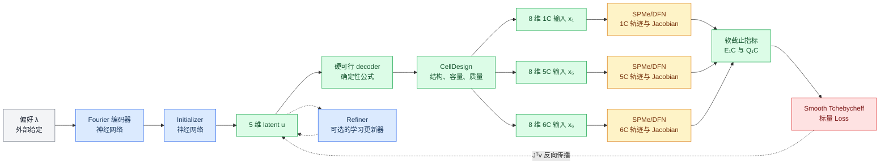

# GradCell 可微优化计算链与代码逐段详解

_面向当前 `grad_cell` 实现的变量、物理公式、神经网络与梯度传播代码导读_

---

## 📋 先给出结论

GradCell 学习的是一个“偏好条件化的电芯设计优化器”：输入偏好 \(\lambda\)，网络先给出一个 5 维无约束设计坐标 \(u\)，确定性的 decoder 再把它变成满足已编码结构约束的电芯设计；1C、5C 和 6C 物理层输出电压轨迹及其对 8 个物理输入的 Jacobian；软指标和带约束 Smooth Tchebycheff 损失把轨迹变成标量；最后通过 \(J^\top v\) 把梯度从 PyBaMM 拉回 PyTorch，更新 initializer 和可选的 refiner。

当前代码的真实优化目标是：

\[
\boxed{\text{1C 比能量}\quad\text{与}\quad\min(E_{5C}/E_{1C},E_{6C}/E_{1C})}
\]

同时施加 \(E_{5C}/E_{1C}\ge0.55\) 和 \(E_{6C}/E_{1C}\ge0.45\) 的默认约束。3C 数据仍生成用于诊断，但不进入主 Loss。



图中蓝色模块的参数由训练学习；绿色模块是固定公式或张量运算；黄色模块是外部物理求解；红色模块定义“什么算好设计”。

## 📚 变量到底是什么

| 符号 | 代码名称 | 形状 | 来源 | 是否由网络直接学习 |
| --- | --- | ---: | --- | --- |
| \(\lambda\) | `preference` | `[B]` 或 `[B,1]` | 训练采样或用户输入 | 否 |
| \(e_\lambda\) | `task_embedding` | `[B,128]` | Fourier encoder | 是，encoder 参数可训练 |
| \(u\) | `latent` | `[B,5]` | initializer/refiner | 是 |
| \(d\) | `CellDesign` | 10 个字段 | decoder 与物理公式 | 否 |
| \(x_c\) | `design.physics_tensor(c_rate)` | `[B,8]` | `CellDesign` 拼接 | 否 |
| \(V_c(t)\) | `y1`、`y5`、`y6` | `[B,1,T]` | toy 或 PyBaMM backend | 否 |
| \(J_c\) | `batch.jacobian` | `[B,1,T,8]` | backend sensitivity | 否 |
| \(E_{1C}\) | `specific_energy_wh_kg` | `[B]` | 软截止积分 | 否 |
| \(R_{5C},R_{6C}\) | `retention_5c`、`retention_6c` | `[B]` | \(E_{5C}/E_{1C}\)、\(E_{6C}/E_{1C}\) | 否 |
| \(L\) | `loss` | `[B]` | Smooth Tchebycheff | 否 |

这里最容易混淆的是三个空间：

- `latent` 是神经网络使用的坐标，不带直接物理意义
- `CellDesign` 是可解释的设计变量与派生量
- `physics_tensor` 是求解器接口要求的 8 维输入

## 🔗 十二步前向计算与代码

### 第 1 步：输入偏好，而不是输入目标值

\(\lambda\in[0,1]\) 是两个目标的权重。当前代码约定 \(\lambda\) 越大越重视 1C 比能量，\(1-\lambda\) 越大越重视最差高倍率能量保持率。它不表示“能量达到 \(\lambda\times100\%\)”。

训练时，每个 batch 都重新采样偏好：

```python
preference = sample_preferences(batch_size, dtype=dtype, device=device)
output = model(preference, num_steps=refinement_steps)
```

代码位置：[`training/trainer.py`](../src/gradcell/training/trainer.py)。

### 第 2 步：Fourier 编码把标量变成可学习表示

编码器保留原始 \(\lambda\)，再加入 8 组正弦和余弦：

\[
\gamma(\lambda)=\left[\lambda,\sin(2\pi\lambda),\cos(2\pi\lambda),\ldots,
\sin(16\pi\lambda),\cos(16\pi\lambda)\right].
\]

因此进入 MLP 前是 \(1+2\times8=17\) 维，经过两层 `Linear + SiLU + LayerNorm` 后得到 128 维 embedding。

```python
features = [preference]
for frequency in range(1, self.frequencies + 1):
    phase = 2.0 * math.pi * frequency * preference
    features.extend([torch.sin(phase), torch.cos(phase)])
return self.network(torch.cat(features, dim=-1))
```

保留原始 \(\lambda\) 很重要：若只有周期特征，\(\lambda=0\) 和 \(\lambda=1\) 的编码完全相同。代码位置：[`models/task_encoder.py`](../src/gradcell/models/task_encoder.py)。

### 第 3 步：Initializer 生成 5 维 latent

Initializer 是残差 MLP，输出为：

\[
u=2\tanh(\Delta_\theta(e_\lambda)),\qquad u_i\in(-2,2).
\]

```python
delta = self.output(self.blocks(self.input(task_embedding)))
return self.initial_scale * torch.tanh(delta)
```

最后一层权重和偏置被初始化为 0：

```python
self.output = nn.Linear(width, latent_dim)
nn.init.zeros_(self.output.weight)
nn.init.zeros_(self.output.bias)
```

因此训练开始时所有偏好都给出 \(u=0\)，也就是同一个区间中部设计。这提高了初始稳定性，但也要求训练后检查不同 \(\lambda\) 是否真的产生不同设计，防止 preference collapse。代码位置：[`models/initializer.py`](../src/gradcell/models/initializer.py)。

### 第 4 步：Decoder 把无约束坐标变成有界物理量

5 个 latent 的对应关系不是顺序预测 5 个独立物理量。实际映射是：

| latent | 直接控制 | 映射方式 |
| --- | --- | --- |
| \(u_0\) | 正极孔隙率 \(\epsilon_p\) | 区间 sigmoid |
| \(u_1\) | 负极孔隙率 \(\epsilon_n\) | 区间 sigmoid |
| \(u_2\) | 隔膜孔隙率 \(\epsilon_s\) | 区间 sigmoid |
| \(u_3\) | 正极活性体积分数 \(\phi_p\) | 在动态可行上界内 sigmoid |
| \(u_4\) | N/P 比 | 区间 sigmoid |

普通有界变量使用：

\[
x=l+(r-l)\sigma(u).
\]

```python
@staticmethod
def _bounded(value, bounds):
    low, high = bounds
    return low + (high - low) * torch.sigmoid(value)

eps_p = self._bounded(latent[..., 0], self.eps_p_bounds)
eps_n = self._bounded(latent[..., 1], self.eps_n_bounds)
eps_s = self._bounded(latent[..., 2], self.eps_s_bounds)
np_ratio = self._bounded(latent[..., 4], self.np_bounds)
```

默认边界是 \(\epsilon_p,\epsilon_n\in[0.20,0.42]\)、\(\epsilon_s\in[0.35,0.60]\)、N/P \(\in[1.02,1.25]\)。由于 initializer 又把 \(u\) 限制在 \((-2,2)\)，initializer 的直接输出通常到不了这些物理边界；refiner 更新后的 latent 没有再次经过 `tanh`，所以它理论上可以进一步靠近边界。

### 第 5 步：耦合约束决定 \(\phi_p\) 的动态上界

decoder 不仅做独立上下界约束，还同时保证正、负极保留最少非活性相。先定义：

\[
\kappa=\mathrm{N/P}\cdot
\frac{L_p c_{p,\max}\Delta\theta_p}
{L_n c_{n,\max}\Delta\theta_n}.
\]

因为后面规定 \(\phi_n=\kappa\phi_p\)，所以 \(\phi_p\) 必须同时满足：

\[
\phi_p\le 1-\epsilon_p-\phi_{p,\mathrm{inactive}}^{\min},
\]

\[
\phi_p\le
\frac{1-\epsilon_n-\phi_{n,\mathrm{inactive}}^{\min}}{\kappa}.
\]

代码取二者较小值：

```python
kappa = np_ratio * numerator / denominator
max_from_positive = 1.0 - eps_p - self.inactive_p_min
max_from_negative = (1.0 - eps_n - self.inactive_n_min) / kappa
phi_p_max = torch.minimum(max_from_positive, max_from_negative)
phi_p = self.phi_p_min + torch.sigmoid(latent[..., 3]) * (
    phi_p_max - self.phi_p_min
)
```

`torch.minimum` 在两分支相等处不可微，但自动微分仍会选择次梯度；在其他位置，梯度只经过当前更紧的约束分支。这正对应“哪个约束正在限制设计”。

### 第 6 步：\(\phi_n\)、容量和质量由物理公式推导

负极活性体积分数不由网络单独预测，而由目标 N/P 精确反解：

\[
\phi_n=\mathrm{N/P}\cdot
\frac{L_p c_{p,\max}\Delta\theta_p}
{L_n c_{n,\max}\Delta\theta_n}\phi_p.
\]

```python
phi_n = negative_active_fraction(phi_p, np_ratio, self.capacity_constants)
```

这让测试可以直接验证 \(Q_n/Q_p=\mathrm{N/P}\)，而不需要额外 penalty。标称容量有两种实现：

```python
if self.capacity_formula == "electrode_theoretical":
    capacity = nominal_capacity_ah(phi_p, self.capacity_constants)
else:
    capacity = chen2020_scaled_capacity_ah(phi_p)
capacity = capacity * self.capacity_multiplier
```

`electrode_theoretical` 使用法拉第常数、厚度、最大浓度、化学计量窗口与面积；`chen2020_scaled` 则以 \(\phi_p=0.665\) 时 5 Ah 为校准点做线性缩放。训练脚本默认使用后者。

质量 `stack_mass_kg(...)` 把正负极固相、电解液、隔膜、集流体和固定硬件相加。容量和质量都是 PyTorch 运算，因此梯度可以沿这两条路径直接回到 latent，不需要 PyBaMM sensitivity。代码位置：[`design/capacity_balance.py`](../src/gradcell/design/capacity_balance.py)、[`design/mass_model.py`](../src/gradcell/design/mass_model.py) 和 [`design/feasible_decoder.py`](../src/gradcell/design/feasible_decoder.py)。

### 第 7 步：CellDesign 组装成 8 维求解器输入

每个倍率下的输入顺序是：

\[
x_c=[\epsilon_p,\epsilon_n,\epsilon_s,\phi_p,\phi_n,D_p^*,D_n^*,I_c].
\]

```python
current_a = self.nominal_capacity_ah * c_rate
return torch.stack(
    [
        self.eps_p,
        self.eps_n,
        self.eps_s,
        self.phi_p,
        self.phi_n,
        self.diffusivity_p_multiplier,
        self.diffusivity_n_multiplier,
        current_a,
    ],
    dim=-1,
)
```

当前 5 维搜索空间把 \(D_p^*=D_n^*=1\) 固定，所以虽然 PyBaMM 会计算电压对这两个输入的 sensitivity，它们对 latent 的导数为 0，不会成为当前设计优化方向。电流则不是独立设计变量：

\[
I_{1C}=Q_{\mathrm{nom}},\qquad I_{5C}=5Q_{\mathrm{nom}},\qquad I_{6C}=6Q_{\mathrm{nom}}.
\]

因此 \(u_3\to\phi_p\to Q_{\mathrm{nom}}\to I_c\to V(t)\) 是一条容易漏掉的间接梯度路径。

### 第 8 步：1C、5C 和 6C 物理层计算轨迹与 Jacobian

`GradCell.evaluate` 对同一设计做三次物理求解：

```python
design = self.design_space(latent)
y1, status1, _ = self.physics_1c(design.physics_tensor(1.0))
y5, status5, _ = self.physics_5c(design.physics_tensor(5.0))
y6, status6, _ = self.physics_6c(design.physics_tensor(6.0))
```

PyBaMM backend 把前 5 个结构量、电流以及两个扩散率乘子注册为 `InputParameter`，使用 IDAKLU 求解固定时间网格，并请求所有输入的 forward sensitivities：

```python
solution = self.simulation.solve(
    self.t_eval,
    inputs=input_dict,
    calculate_sensitivities=list(self.input_names),
)
```

对单一电压输出，Jacobian 为：

\[
J=\frac{\partial V}{\partial x}\in\mathbb{R}^{T\times8}.
\]

batch 形式是 `[B,1,T,8]`。训练默认关闭物理电压 cutoff，把上下截止值放宽到 \(-10\) V 和 10 V，以尽量获得统一长度轨迹；1C、5C、6C horizon 分别是 3600 s、720 s、600 s。低电压是否“还有效”交给下一步的 smooth gate。

### 第 9 步：自定义 autograd 用 \(J^\top v\) 跨过外部求解器

PyBaMM 返回 NumPy 数据，不能靠普通 PyTorch 自动追踪。前向中代码主动 `detach()`，然后保存显式 Jacobian：

```python
batch = backend.solve_batch(
    physics_inputs.detach().cpu().double().numpy()
)
ctx.save_for_backward(jac)
return y, status, runtime
```

反向时，上游给出：

\[
v=\frac{\partial L}{\partial V},
\]

代码计算：

\[
\frac{\partial L}{\partial x}=J^\top v.
\]

```python
grad_inputs = torch.einsum("bot,botp->bp", grad_y, jacobian)
return grad_inputs, None
```

`einsum` 对输出通道 \(o\) 与时间 \(t\) 求和，保留物理输入维 \(p\)。`status` 和 `runtime` 只是记录量，没有梯度。代码位置：[`physics/autograd_layer.py`](../src/gradcell/physics/autograd_layer.py) 和 [`physics/backend.py`](../src/gradcell/physics/backend.py)。

### 第 10 步：Soft gate 把固定时域轨迹变成可微放电指标

硬截止会在 \(V<V_{\mathrm{cut}}\) 时突然终止，终止时刻随设计不连续变化。代码改用 sigmoid 门：

\[
g_t=\sigma\left(\frac{V_t-V_{\mathrm{cut}}}{\delta}\right).
\]

```python
gate = torch.sigmoid((voltage - cutoff_v) / temperature_v)
```

默认 \(V_{\mathrm{cut}}=2.5\) V、\(\delta=0.02\) V。基于均匀时间网格，代码计算：

\[
E_{\mathrm{usable}}=\frac{1}{3600}\int I(t)V(t)g(t)\,dt,
\qquad
Q_{\mathrm{delivered}}=I\frac{1}{3600}\int g(t)\,dt.
\]

```python
usable_wh = torch.trapezoid(
    current_a[:, None] * voltage * gate, dx=dt, dim=-1
) / 3600.0
effective_h = torch.trapezoid(gate, dx=dt, dim=-1) / 3600.0
specific_energy = usable_wh / mass_kg
delivered_capacity = current_a * effective_h
```

`/3600` 把 A·V·s 转成 Wh，质量单位是 kg，所以 `specific_energy` 是 Wh/kg。

代码也计算：

```python
specific_power = specific_energy / effective_h.clamp_min(1e-6)
soft_min_voltage = -0.02 * torch.logsumexp(-voltage / 0.02, dim=-1)
```

但当前 `GradCell.evaluate` 没有使用 `specific_power` 或 `soft_min_voltage` 构造损失。后者目前只是返回的诊断字段，并不是欠压约束。代码位置：[`physics/soft_metrics.py`](../src/gradcell/physics/soft_metrics.py)。

### 第 11 步：5C/6C 能量保持率、物理约束与 Smooth Tchebycheff

当前高倍率指标与第二目标为：

\[
R_5=\frac{E_{5C}}{\max(E_{1C},10^{-8})},\qquad
R_6=\frac{E_{6C}}{\max(E_{1C},10^{-8})},\qquad
R_{\mathrm{high}}=\min(R_5,R_6).
\]

```python
valid_energy = metrics1.specific_energy_wh_kg
energy_1c = metrics1.specific_energy_wh_kg.clamp_min(1e-8)
valid_retention_5c = metrics5.specific_energy_wh_kg / energy_1c
valid_retention_6c = metrics6.specific_energy_wh_kg / energy_1c
valid_loss = self.objective(
    valid_energy, valid_retention_5c, valid_retention_6c, preference[valid]
)
```

两个最大化目标先变成“距 ideal 越远越差”的归一化距离：

\[
d_E=\frac{E_{\mathrm{ideal}}-E}{E_{\mathrm{ideal}}-E_{\mathrm{nadir}}},\qquad
d_R=\frac{R_{\mathrm{ideal}}-\min(R_5,R_6)}{R_{\mathrm{ideal}}-R_{\mathrm{nadir}}}.
\]

再计算增广平滑 Tchebycheff 基础项 \(L_{\mathrm{Tch}}\)，并增加高倍率约束：

\[
L_{\mathrm{Tch}}=\tau\log\left[
\exp\left(\frac{\lambda d_E}{\tau}\right)+
\exp\left(\frac{(1-\lambda)d_R}{\tau}\right)
\right]
+\rho\left[\lambda d_E+(1-\lambda)d_R\right].
\]

\[
L=L_{\mathrm{Tch}}+\gamma\left[
\operatorname{ReLU}(r_{5,\min}-R_5)^2+
\operatorname{ReLU}(r_{6,\min}-R_6)^2\right].
\]

```python
weights = torch.stack([preference, 1.0 - preference], dim=-1)
weighted = weights * distances
smooth_max = self.temperature * torch.logsumexp(
    weighted / self.temperature, dim=-1
)
constraint = (
    torch.relu(self.retention_5c_min - retention_5c).square()
    + torch.relu(self.retention_6c_min - retention_6c).square()
)
return smooth_max + self.augmented_weight * weighted.sum(dim=-1) \
    + self.constraint_weight * constraint
```

默认 \(\tau=0.05\)、\(\rho=0.05\)、\(r_{5,\min}=0.55\)、\(r_{6,\min}=0.45\)、\(\gamma=2\)。正式训练通过 `--reference-front` 加载由设计域标定的 ideal/nadir 和约束参数。参考 Pareto 也只保留满足两个硬约束的样本，使基准和训练语义一致。代码位置：[`losses/scalarization.py`](../src/gradcell/losses/scalarization.py)、[`scripts/build_reference_front.py`](../scripts/build_reference_front.py) 和 [`scripts/train_mvp.py`](../scripts/train_mvp.py)。

### 第 12 步：反向传播并可选地做 K 步 refinement

若 `num_steps=0`，模型只评价 initializer 的输出。若 \(K>0\)，每一步先求当前 loss 对 latent 的梯度：

```python
(gradient,) = torch.autograd.grad(
    step.loss.sum(), latent, create_graph=False, retain_graph=True
)
gradient = gradient.detach()
```

refiner 接收偏好 embedding、当前 latent、5 个物理特征和归一化梯度，通过 GRU 预测一个标量步长 \(\alpha_k\) 与 5 维正对角缩放 \(D_k\)：

```python
normalized_gradient = gradient / gradient.square().mean(
    dim=-1, keepdim=True
).sqrt().clamp_min(1e-8)

step = self.max_step_size * torch.sigmoid(self.step_head(state))
diagonal = self.diagonal_min + (
    self.diagonal_max - self.diagonal_min
) * torch.sigmoid(self.diagonal_head(state))
```

更新为：

\[
u_{k+1}=u_k-\alpha_kD_k\operatorname{stopgrad}(\nabla_{u_k}L_k).
\]

```python
latent = latent - alpha * diagonal * gradient
```

`gradient.detach()` 避免训练 refiner 时要求 PyBaMM 提供二阶敏感度。更新仍通过显式的 `latent`、`alpha` 和 `diagonal` 保留一阶路径，但忽略“梯度本身随 latent 变化”的 Hessian 项。代码位置：[`models/refiner.py`](../src/gradcell/models/refiner.py) 和 [`models/gradcell.py`](../src/gradcell/models/gradcell.py)。

## 🎯 完整梯度到底沿哪些路径传播

设 decoder 为 \(d=D(u)\)，求解器输入为 \(x=C(d)\)，轨迹为 \(V=S(x)\)，则：

\[
\frac{\partial L}{\partial u}
=
\underbrace{
\frac{\partial L}{\partial V}
\frac{\partial V}{\partial x}
\frac{\partial x}{\partial d}
\frac{\partial d}{\partial u}
}_{\text{经过 PyBaMM 的轨迹路径}}
+
\underbrace{
\frac{\partial L}{\partial Q}
\frac{\partial Q}{\partial d}
\frac{\partial d}{\partial u}
}_{\text{容量直接路径}}
+
\underbrace{
\frac{\partial L}{\partial m}
\frac{\partial m}{\partial d}
\frac{\partial d}{\partial u}
}_{\text{质量直接路径}}.
\]

其中只有 \(\partial V/\partial x\) 需要 PyBaMM 显式提供。其余部分都是 PyTorch 张量运算，由 autograd 自动连接。

更具体地说，\(\phi_p\) 至少同时影响：

- 正极材料含量及 \(\phi_n\)
- 标称容量与 1C/5C/6C 电流
- 电堆质量
- PyBaMM 中的正、负极活性体积分数
- 软能量积分和 5C/6C 能量保持率

所以“某个 Jacobian 列很大”并不等于“对应 latent 最重要”。最终方向还取决于 loss 对各时间点的上游权重、decoder 的链式导数，以及容量和质量的直接路径。

## ⚠️ 失败样本实际发生了什么

代码首先把每个样本的默认 loss 写为：

\[
L_{\mathrm{fail}}=100+0.1\operatorname{mean}(u^2).
\]

```python
loss = 100.0 + 0.1 * latent.square().mean(dim=-1)
```

只有 1C、5C、6C 都成功且轨迹有限的样本，才会用真实目标覆盖该值：

```python
valid = status1.bool() & status3.bool() & finite1 & finite3
loss = loss.index_copy(0, valid_indices, valid_loss)
```

对 5 维 latent，失败 penalty 的梯度是：

\[
\frac{\partial L_{\mathrm{fail}}}{\partial u_i}=\frac{0.2}{5}u_i.
\]

它只会把设计拉回 \(u=0\) 的 nominal 区域，并不知道真正的可行边界方向。若整批样本全部失败，trainer 会直接终止训练并要求检查 backend diagnostics，而不是继续依赖这个恢复项。

PyBaMM backend 对失败样本返回有限的零轨迹和零 Jacobian，同时以 `status=0` 标记；这样可以防止 NaN 进入 PyTorch，但零轨迹本身不能被当作物理结果。

## ✅ 如何验证这条链不是“能反传但传错了”

### Decoder 约束测试

[`tests/test_decoder.py`](../tests/test_decoder.py) 已检查：

- 正、负极非活性相不低于最小值
- N/P 位于配置边界内
- 由 \(\phi_n\) 反算得到的容量比精确等于目标 N/P
- 当前两个扩散率乘子恒为 1

### 自定义 backward 的方向导数测试

代码使用中心有限差分比较：

\[
\nabla f(x)^\top r
\quad\text{与}\quad
\frac{f(x+\epsilon r)-f(x-\epsilon r)}{2\epsilon}.
\]

```python
value = function(point)
(gradient,) = torch.autograd.grad(value, point)
autodiff = torch.sum(gradient * direction)

with torch.no_grad():
    finite_difference = (
        function(point + eps * direction)
        - function(point - eps * direction)
    ) / (2.0 * eps)
```

[`tests/test_autograd_layer.py`](../tests/test_autograd_layer.py) 先用具有解析 Jacobian 的 toy backend 验证自定义 `Jᵀv`，误差阈值为 \(10^{-5}\)。这能证明 autograd 包装逻辑正确，但不能单独证明 PyBaMM sensitivity、插值与真实 loss 全链都正确。

### 端到端检查

[`scripts/validate_end_to_end_gradients.py`](../scripts/validate_end_to_end_gradients.py) 会检查：

\[
u\rightarrow d\rightarrow x\rightarrow V(t)\rightarrow(E,R)\rightarrow L
\]

整条链的随机方向导数。实际使用时应测试多个随机点、多个方向与多组 \(\epsilon\)，因为过大扰动会破坏局部线性，过小扰动又会被求解器容差和浮点误差淹没。

```powershell
python scripts\validate_gradients.py --backend toy
python scripts\validate_end_to_end_gradients.py --backend toy
python scripts\validate_end_to_end_gradients.py --backend pybamm
```

## 📍 训练阶段与推理阶段

训练每一步对一批偏好执行 \(K+1\) 次设计评价，取所有中间 loss 的均值。若有 refinement，还增加“下一步不要变差”的平滑单调项与步长 penalty：

```python
intermediate = torch.stack([step.loss for step in output.steps], dim=0)
loss = intermediate.mean()

monotonic = torch.nn.functional.softplus(
    intermediate[1:] - intermediate[:-1] + 1e-3
).mean()
step_penalty = torch.stack([
    (output.steps[i + 1].latent - output.steps[i].latent).square().mean()
    for i in range(len(output.steps) - 1)
]).mean()
loss = loss + 0.5 * monotonic + 1e-3 * step_penalty
```

随后用 AdamW、梯度裁剪、验证集、早停和 checkpoint 更新网络参数。推理时给定新 \(\lambda\)，可以只用 initializer，也可以追加 \(K\) 步 refiner。无论训练 smooth loss 多低，最终结论都应由保留物理 cutoff 的 SPMe/DFN 重新评价。

计算预算也必须公平：每次训练评价包含 1C、5C、6C 三个工况，因此单样本 \(K\) 步 refinement 至少对应 \(3(K+1)\) 次物理求解。参考数据额外生成 3C 诊断。比较 \(K=0,1,3,5\) 时，应同时报告 solver-call budget 或 wall-clock。

## 🔍 当前实现与旧版文字表述的差异

| 主题 | 当前代码事实 | 阅读时应采用的表述 |
| --- | --- | --- |
| 第二目标 | `min(E_5C/E_1C, E_6C/E_1C)` | 最差高倍率能量保持率 |
| 高倍率约束 | `R5 >= 0.55`, `R6 >= 0.45` | Pareto 使用硬筛选，训练使用平方 hinge penalty |
| 比功率 | 被 `discharge_metrics` 计算 | 诊断量，不进入 GradCell 主 loss |
| soft minimum | 被计算并返回 | 尚未形成欠压 penalty |
| 扩散率乘子 | 两个值恒为 1 | 是求解器输入，但不是当前 latent 设计变量 |
| 设计维度 | 5 维 latent | 其中 \(\phi_n\)、容量、质量、电流均为派生量 |
| 固定时域 | 默认放宽 PyBaMM cutoff | smooth gate 是训练 proxy，非最终 hard 指标 |
| 失败恢复 | 中心回拉 penalty | 不能学习真实失败边界；全批失败会终止 |
| 配置文件 | `mvp.yaml` 保存建议参数 | `train_mvp.py` 当前通过命令行参数构建，未直接读取该 YAML |
| 模型默认值 | `train_mvp.py --model` 默认 DFN | “当前一定使用 SPMe”并不准确，取决于命令参数 |

这些差异不是措辞问题，而会改变论文中的方法定义、实验对照和结论边界。

## 🧭 建议的阅读与实验顺序

1. 只运行 decoder，打印 \(u=0\) 及随机 \(u\) 的全部 `CellDesign` 字段
2. 验证 N/P、非活性相与容量公式，不启动 PyBaMM
3. 用 toy backend 理解 `[B,1,T]` 轨迹和 `[B,1,T,8]` Jacobian
4. 手工构造线性下降电压，核对 gate、Wh、Ah、Wh/kg 与 retention
5. 运行 toy 的 `Jᵀv` 有限差分测试
6. 运行 PyBaMM 单点、多方向、多 \(\epsilon\) 端到端梯度检查
7. 固定一个 \(\lambda\)，直接优化单个 latent，确认 hard 指标也改善
8. 训练 initializer 并画 \(\lambda\mapsto u_i\) 检查偏好塌缩
9. 最后加入 refiner，并按相同物理调用预算比较 \(K\)

判断成功不能只看训练 loss 下降。至少还要观察 solver success rate、方向导数误差、smooth/hard 指标相关性、Pareto coverage、Hypervolume、DFN 复核通过率，以及单个有效设计的计算成本。

## 📚 一句话串起代码

`FourierPreferenceEncoder` 解释偏好，`DesignInitializer` 提出 5 维 latent，`DesignSpace` 用确定性公式得到硬约束设计、容量和质量，`CellDesign.physics_tensor` 生成 1C/5C/6C 的 8 维输入，`PyBaMMBackend` 返回电压与 sensitivity，`DifferentiablePhysicsLayer` 用 \(J^\top v\) 接回 PyTorch，`discharge_metrics` 得到各倍率能量，`SmoothTchebycheff` 把 1C 比能量、最差高倍率能量保持率和约束 penalty 合成 loss，而 `DiagonalPhysicsRefiner` 使用 detach 后的一阶物理梯度做少量在线修正。

最值得牢牢记住的是：

\[
\boxed{
\text{网络只学习“提出与修改设计”}
\quad\text{；}\quad
\text{约束、容量、质量、仿真与指标都有明确代码来源}
}
\]
