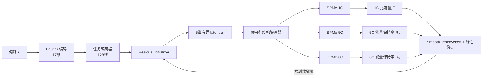

# GradCell K=0 实验报告：偏好条件化电芯设计初始化器

**实验标识：** K=0 initializer，SPMe，1C/5C/6C，高倍率线性约束版本

**模型随机种子：** 7

**参考数据随机种子：** 101
**报告日期：** 2026-09-05

## 摘要

本实验验证 GradCell 的第一项核心能力：是否能够训练一个偏好条件化初始化器，把用户给定的能量—高倍率性能偏好 \(\lambda\in[0,1]\) 直接映射为可行电芯设计。K=0 表示模型只使用神经网络产生初始设计，不执行后续的梯度型 refiner 更新。网络输出五维有界 latent，经硬可行解码器转换为电极与隔膜结构参数，再分别送入 PyBaMM SPMe 的 1C、5C 和 6C 放电仿真。训练目标同时最大化 1C 比能量和最差高倍率能量保持率 \(\min(R_5,R_6)\)，并通过线性罚项要求 \(R_5\geq0.50\)、\(R_6\geq0.44\)。梯度由电芯目标穿过可微指标、PyBaMM 前向灵敏度、自定义向量—雅可比积、结构解码器和神经网络完成端到端反传。

在 21 个标准偏好点的 hard-cutoff SPMe 评价中，仿真成功率和约束满足率均为 100%，全部候选设计优于标称设计；相对有限参考 Pareto 集的平均 scalarized regret 为 0.00631，中位数为 0.00124。20 个离网格中点同样全部仿真成功、满足约束并优于标称设计，能量随 \(\lambda\) 单调增加、6C 保持率单调下降，说明模型确实学习到了偏好到设计的连续映射，而不是对 21 个评价点输出同一个方案。不过，\(\lambda=0.175\rightarrow0.225\) 存在显著 latent 跳变，且高能量端 regret 较大；前三个 latent 长期接近上边界。这表明当前模型在 Pareto 膝点附近可能发生设计分支切换，设计自由度也存在部分饱和。现有结果不支持“明显过拟合”的判断，但由于只有一个模型种子、训练与评价均使用 SPMe、训练偏好样本未逐项留档，因此还不能证明跨种子、跨物理模型或严格 held-out 偏好泛化。

## 1. 实验目的

GradCell 的目标不是单点回归某个固定性能值，而是学习一个能够响应多目标偏好的设计生成器。K=0 实验回答的问题是：不给模型任何迭代优化步骤，只提供偏好 \(\lambda\)，神经网络能否一次性提出满足物理结构约束和高倍率约束、并接近参考 Pareto 前沿的电芯设计。

这里 \(\lambda=1\) 更偏重 1C 比能量，\(\lambda=0\) 更偏重高倍率保持率。理想模型不应为所有 \(\lambda\) 输出同一设计，而应随着偏好变化生成一族有序、可行且性能互有取舍的设计。K=0 同时也是后续 K=3 refiner 的起点：只有先证明 initializer 学会了可靠映射，才能判断迭代细化带来的增益是否真实。



## 2. 模型框架

### 2.1 偏好编码与初始化网络

模型唯一的任务输入是标量偏好 \(\lambda\)。`FourierPreferenceEncoder` 将它与 1 至 8 阶的正弦、余弦特征拼接，形成 \(1+2\times8=17\) 维特征：

\[
x(\lambda)=\left[\lambda,\sin(2\pi\lambda),\cos(2\pi\lambda),\ldots,
\sin(16\pi\lambda),\cos(16\pi\lambda)\right].
\]

该特征经过两层带 SiLU 与 LayerNorm 的全连接网络，得到 128 维任务嵌入。`DesignInitializer` 随后使用宽度为 256 的输入层和四个残差块生成五维向量。输出层初始化为零，并通过

\[
u_0=2\tanh(\Delta u)
\]

把每个 latent 分量限制在 \((-2,2)\) 内。零初始化意味着训练开始时所有偏好均对应标称 latent \(u=0\)，之后网络才逐步学习偏好相关的设计差异。

### 2.2 硬可行设计解码

五维 latent 不直接作为 PyBaMM 参数，而是由 `DesignSpace` 确定性地解码为结构设计。前三维分别控制正极孔隙率、负极孔隙率和隔膜孔隙率；第四维控制正极活性材料体积分数；第五维控制 N/P 比。负极活性材料体积分数由容量平衡关系推导，而不是独立预测。当前阶段固定 Chen2020 材料体系，正负极固相扩散系数乘子均为 1，因此模型优化的是结构而非材料动力学参数。

| 设计量 | 来源 | 范围或约束 | 含义 |
|---|---|---:|---|
| \(\varepsilon_p\) | \(u_1\) 经 sigmoid | 0.20–0.42 | 正极孔隙率 |
| \(\varepsilon_n\) | \(u_2\) 经 sigmoid | 0.20–0.42 | 负极孔隙率 |
| \(\varepsilon_s\) | \(u_3\) 经 sigmoid | 0.35–0.60 | 隔膜孔隙率 |
| \(\phi_p\) | \(u_4\) 经动态上界映射 | 同时满足孔隙、非活性相与容量平衡 | 正极活性材料体积分数 |
| N/P | \(u_5\) 经 sigmoid | 1.02–1.25 | 负极容量与正极容量之比 |
| \(\phi_n\) | 容量平衡公式推导 | 与 \(\phi_p\)、N/P 联动 | 负极活性材料体积分数 |

这种解码方式把孔隙率边界、最小非活性材料比例和电极容量平衡直接写入参数化过程。网络不能生成违反这些硬结构约束的设计，因此无需依赖额外 Loss 去“学会”基本可行性。

### 2.3 SPMe 物理计算链

每个设计分别在 1C、5C 和 6C 下执行 PyBaMM SPMe 放电仿真，对应固定计算时域 3600 s、720 s 和 600 s。标称容量使用 `chen2020_scaled` 公式，并乘以参考数据校准得到的 1.2589438522。仿真输入张量包含正负极与隔膜孔隙率、正负极活性材料体积分数、两个固定为 1 的扩散系数乘子以及由标称容量和 C-rate 得到的电流。

软截止门函数定义为

\[
g(V)=\sigma\!\left(\frac{V-2.5}{0.02}\right),
\]

并用于计算可微的放电能量。某一倍率 \(C\) 下的比能量可写成

\[
E_C=\frac{1}{3600m}\int I_CV_C(t)g(V_C(t))\,dt,
\]

其中 \(m\) 是解码器计算的电堆质量。训练指标为

\[
E=E_{1C},\qquad R_5=\frac{E_{5C}}{E_{1C}},\qquad
R_6=\frac{E_{6C}}{E_{1C}},\qquad R_{\mathrm{high}}=\min(R_5,R_6).
\]

这里使用的是高倍率**能量保持率**，不是容量保持率。实验数据中通常有 \(R_6<R_5\)，因此最差高倍率目标多数由 6C 决定。

## 3. 实验数据与参考 Pareto 前沿

### 3.1 数据制造流程

参考数据不是实验室实测数据，而是在五维可行设计空间内随机采样 5000 个结构方案，并用 PyBaMM SPMe 进行 hard-cutoff 的 1C、3C、5C 和 6C 放电计算得到。K=0 当前使用的主要字段为 1C、5C 和 6C 能量。参考数据文件为 `data/gradcell_reference_spme_1c5c6c_5000_s101.npz`，采样种子为 101。

5000 个样本显示出明显的双簇或强非均匀分布。5C 能量保持率范围为 0.02783–0.52306，中位数仅为 0.14935，而第 75 百分位跃升至 0.51276；6C 范围为 0.02540–0.46146，中位数为 0.08660，第 90 百分位达到 0.45301。\(R_5\) 与 \(R_6\) 的相关系数为 0.7333。早期尝试的 \(R_5\geq0.55\)、\(R_6\geq0.45\) 中，5C 阈值超过整个样本集最大值，因此没有任何可行样本。最终阈值调整为

\[
R_5\geq0.50,\qquad R_6\geq0.44,
\]

使约束落在已观测高倍率性能区域内，同时保留足够的设计取舍空间。

### 3.2 参考 Pareto 集

在满足上述约束的样本中，按“最大化 1C 比能量”和“最大化 \(\min(R_5,R_6)\)”进行非支配筛选，得到 25 个互不相同的 Pareto 设计。其统计范围如下。

| 指标 | 参考 Pareto 范围 |
|---|---:|
| 1C 比能量 | 112.9399–162.4365 Wh/kg |
| 5C 能量保持率 | 0.515175–0.523060 |
| 6C 能量保持率 | 0.448766–0.461458 |
| 两目标相关系数 | -0.451304 |

负相关说明能量与高倍率保持率之间确实存在取舍，但前沿是有限的 5000 次随机搜索结果，而不是真实全局 Pareto 前沿。后续所谓 oracle 只是针对该有限参考集，在每个 \(\lambda\) 下选择 scalarized loss 最小的样本。

## 4. Loss、梯度与训练流程

### 4.1 多目标标量化

首先使用参考前沿中的 ideal 与 nadir 对两个目标归一化：

\[
d_E=\frac{E_{\mathrm{ideal}}-E}{E_{\mathrm{ideal}}-E_{\mathrm{nadir}}},\qquad
d_R=\frac{R_{\mathrm{ideal}}-\min(R_5,R_6)}
{R_{\mathrm{ideal}}-R_{\mathrm{nadir}}}.
\]

偏好权重为 \(w=[\lambda,1-\lambda]\)。Smooth augmented Tchebycheff Loss 为

\[
L_{\mathrm{tch}}=	au\log\sum_j
\exp\left(\frac{w_jd_j}{\tau}\right)
+\rho\sum_jw_jd_j,
\]

其中 \(\tau=0.05\)、\(\rho=0.05\)。它近似最小化两个加权目标距离中的较大者，并用较小的加和项改善 Pareto 解的区分度。

高倍率约束采用线性 ReLU 罚项：

\[
L_{\mathrm{constraint}}=5\left[
\max(0,0.50-R_5)+\max(0,0.44-R_6)\right].
\]

最终单样本目标为

\[
L=L_{\mathrm{tch}}+L_{\mathrm{constraint}}.
\]

线性罚项在违反约束时保持非零的一阶梯度，比此前平方罚项更能阻止设计停留在边界外。若物理仿真失败，代码使用 \(100+0.1\lVert u\rVert_2^2/5\) 作为失败损失；若整个 batch 均失败，训练会直接中止，避免把失败区域误当作可学习的正常目标。

### 4.2 端到端反传

K=0 的 batch Loss 是 \(L(u_0)\) 的均值。执行 `loss.backward()` 后，梯度路径为

\[
L\rightarrow(E,R_5,R_6)\rightarrow V_{1C,5C,6C}(t)
\rightarrow\text{SPMe参数}\rightarrow\text{结构设计}
\rightarrow u_0\rightarrow\text{initializer与任务编码器参数}.
\]

PyBaMM 在 CPU 上完成 SPMe 正向求解和参数前向灵敏度计算；自定义 PyTorch 层在反向阶段计算向量—雅可比积 \(J^Tv\)。因此 Loss 的确在进行梯度下降，而且物理仿真位于训练计算图中，不是离线标签或训练后的独立评价器。

### 4.3 训练设置

本次 K=0 使用 1000 个训练 step、batch size 8、AdamW 优化器、学习率 \(3\times10^{-4}\)、weight decay \(10^{-5}\)，并将梯度范数裁剪到 1.0。偏好采样并非只取固定网格：50% 来自均匀分布，25% 来自 \(\mathrm{Beta}(0.5,2)\) 以加强高倍率端，25% 来自 \(\mathrm{Beta}(2,0.5)\) 以加强高能量端。每 25 step 在 11 个固定偏好点上计算验证 Loss并保存最优模型。1000 step 的服务器训练耗时约 19654 s，即 5.46 h，主要开销是 CPU 上每个 batch 的三组 SPMe 仿真及灵敏度计算，而不是小型神经网络本身。

训练期间每个 step 采样 8 个 \(\lambda\)，因此一轮 1000-step 训练处理了 8000 个“偏好实例”。这些不是 8000 个预先保存的监督样本，而是运行时动态产生的任务输入；同一个或相近的 \(\lambda\) 可以在不同 step 再次出现，其设计会随着网络权重更新而变化。每个偏好需要执行 1C、5C、6C 三次物理求解，因此主训练阶段理论上执行

\[
1000\times8\times3=24,000
\]

次 SPMe 前向求解。若完整训练每 25 step 在 11 个偏好上验证一次，则 40 次验证额外产生 \(40\times11\times3=1320\) 次求解；训练开始前 \(\lambda=0,0.5,1\) 的 preflight 再产生 9 次。因此在没有早停、重试和失败额外求解的理想计数下，总计约 25,329 次 SPMe 求解。这个数值是根据配置推导的工作量，不是从求解器日志直接统计的实测调用数；若需要精确数目，应在物理 backend 中增加调用计数器。

### 4.4 数据类型与张量形状

本轮网络使用 PyTorch float64，以匹配物理求解和灵敏度计算所需的数值精度。设 batch size 为 \(B=8\)，主要张量形状如下。PyBaMM 返回的电压轨迹长度取决于 backend 的统一输出网格，本文未获得服务器数组形状，因此以 \(T_C\) 表示对应倍率的时间点数。

| 数据 | dtype | 形状 | 来源与作用 |
|---|---|---:|---|
| preference \(\lambda\) | float64 | \([B]\) | 在线随机采样的多目标偏好 |
| Fourier 特征 | float64 | \([B,17]\) | \(\lambda\) 与 8 组 sin/cos |
| task embedding | float64 | \([B,128]\) | 偏好编码器输出 |
| latent \(u_0\) | float64 | \([B,5]\) | initializer 输出 |
| 解码物理输入 | float64 | \([B,8]\) | 5 个结构量、推导量、固定扩散乘子和电流 |
| 1C/5C/6C 电压 | float64 | \([B,T_1]\)、\([B,T_5]\)、\([B,T_6]\) | SPMe 输出 |
| status | int64/bool | \([B]\) | 三倍率仿真是否均成功且有限 |
| \(E,R_5,R_6,L\) | float64 | 各为 \([B]\) | 指标与单样本 Loss |
| batch Loss | float64 | 标量 | 单样本 Loss 的均值 |

5000 个参考样本与 K=0 在线训练任务是两套不同数据流。前者是离线随机设计—仿真数据，用于确定可行区、构建有限参考 Pareto 集、提供 ideal/nadir 和评价 oracle；后者不读取 5000 个设计作为标签，而是由当前网络在线提出设计并直接通过 SPMe 计算 Loss。因而不能把 K=0 简化描述为“用 5000 条数据训练 0.58M 参数的监督网络”。更准确的描述是：5000 条离线数据负责标定和评价，约 8000 个动态偏好实例及约 25,329 次 SPMe 求解负责单次 K=0 端到端训练与验证。

## 5. 实验结果

### 5.0 模型规模与计算量

当前完整 `GradCell` 对象包含任务编码器、initializer 和 refiner，共有 686,091 个神经网络参数。不过 K=0 前向过程中 `num_steps=0`，refiner 不参与结果计算，因而本实验实际被 Loss 约束并获得有效梯度的是任务编码器与 initializer，共 580,485 个参数。其中 Fourier 偏好编码器有 19,328 个参数，initializer 有 561,157 个参数；未被 K=0 使用的 refiner 有 105,606 个参数。按 float64 计算，K=0 权重本身约占 4.64 MB；若计入梯度和 AdamW 的一阶、二阶状态，参数相关存储约为 18.6 MB。训练耗时并非由网络规模主导，而是由每个 batch 对 1C、5C、6C 三套 SPMe 方程进行求解和灵敏度计算所主导。

### 5.1 标准偏好网格评价

在 \(\lambda=0,0.05,\ldots,1.0\) 共 21 个偏好点上，使用 hard-cutoff SPMe 重新评价 K=0 候选方案，得到如下结果。

| 指标 | K=0 线性约束结果 |
|---|---:|
| SPMe 仿真成功率 | 1.0000 |
| 5C/6C 约束满足率 | 1.0000 |
| 平均 scalarized regret | 0.006311 |
| 中位 scalarized regret | 0.001241 |
| 优于标称设计的比例 | 1.0000 |
| 唯一 latent 设计数 | 21/21 |
| latent 两端距离 | 5.32596 |
| 1C 比能量范围 | 113.8299–159.7662 Wh/kg |
| 5C 能量保持率范围 | 0.515186–0.522984 |
| 6C 能量保持率范围 | 0.442010–0.461338 |

这些数字表明模型没有发生偏好坍缩：21 个偏好点产生了 21 个不同设计，且能覆盖从高倍率优先到高能量优先的性能区间。最高预测能量低于有限参考前沿的 162.4365 Wh/kg，但换来了所有偏好点均满足高倍率约束。Regret 的量级较小，说明大多数候选接近当前参考集在相同偏好下的最佳标量化结果。

### 5.2 线性约束相对平方约束的改进

此前平方约束版本的约束满足率为 20/21，即 0.95238；平均 regret 为 0.007058，中位 regret 为 0.002848。改为线性约束后，约束满足率提高到 21/21，平均 regret 降低约 10.6%，中位 regret 降低约 56.4%，同时仍保持所有候选优于标称设计。代价是候选最大能量由约 160.738 降至 159.766 Wh/kg，下降不足 1 Wh/kg。这个取舍是合理的，因为旧版本的最高能量端曾把 \(R_6\) 降到约 0.4215，明显违反 0.44 的约束。

### 5.3 离网格偏好插值

为避免只在标准评价网格上验证，进一步使用 \(0.025,0.075,\ldots,0.975\) 共 20 个中点进行测试。这些数值不在标准 0.05 网格上，但由于历史训练过程中随机抽取的精确 \(\lambda\) 未被记录，本测试只能称为离网格插值，不能称为严格从未见过的 held-out-\(\lambda\) 测试。

| 指标 | 离网格中点结果 |
|---|---:|
| SPMe 仿真成功率 | 1.0000 |
| 约束满足率 | 1.0000 |
| 优于标称设计比例 | 1.0000 |
| 平均 / 中位 / 最大 regret | 0.005442 / 0.002290 / 0.032285 |
| 唯一 latent 设计数 | 20/20 |
| 能量单调性违反次数 | 0 |
| 6C 保持率单调性违反次数 | 0 |
| 平均 / 中位相邻 latent 距离 | 0.35935 / 0.17362 |
| 最大相邻 latent 距离 | 3.68338 |

离网格能量范围为 113.8314–159.7681 Wh/kg，\(R_5\) 范围为 0.515185–0.522983，\(R_6\) 范围为 0.441905–0.461338。能量随能量偏好增强而单调上升，6C 保持率则单调下降，符合多目标取舍的物理与优化语义。这是模型学习到条件映射的直接证据。

### 5.4 原始参考样本的高倍率性能分布

原始 5000 个 SPMe 样本的分位数进一步说明，设计空间不是一个均匀、平滑的简单区域。5C 性能在第 50 至第 75 百分位之间由 0.14935 快速上升到 0.51276；6C 性能则在第 75 至第 90 百分位之间由 0.15313 上升到 0.45301。也就是说，相当一部分随机设计在高倍率下很早触发电压截止，而另一批设计集中在较窄的高性能平台上。这种分布会使 Pareto 前沿和神经网络映射出现明显膝点。

| 分位数 | \(R_5=E_{5C}/E_{1C}\) | \(R_6=E_{6C}/E_{1C}\) | \(\min(R_5,R_6)\) |
|---:|---:|---:|---:|
| P00 | 0.027826 | 0.025402 | 0.025402 |
| P01 | 0.034065 | 0.030409 | 0.030409 |
| P05 | 0.044593 | 0.038279 | 0.038279 |
| P10 | 0.052295 | 0.043607 | 0.043607 |
| P25 | 0.076452 | 0.058590 | 0.058590 |
| P50 | 0.149352 | 0.086599 | 0.086599 |
| P75 | 0.512758 | 0.153132 | 0.153132 |
| P90 | 0.517171 | 0.453008 | 0.453008 |
| P95 | 0.518865 | 0.455777 | 0.455777 |
| P99 | 0.520911 | 0.458648 | 0.458648 |
| P100 | 0.523060 | 0.461458 | 0.461458 |

不同候选阈值下的联合可行样本数量如下。该表来自完整 5000 样本而不是 Pareto 子集，可用于解释为何最终约束需要依据真实分布设置。P50 阈值仍保留 2355 个联合可行样本，而最初尝试的 \(R_5\geq0.55\) 已超过观测最大值 0.52306，因此可行数必然为零。当前正式阈值 0.50/0.44 不对应表中同一分位数组合，而是针对高性能平台设置的工程阈值；仍应在完整数据上另外报告其确切联合可行数。

| 阈值来源 | \(R_{5,\min}\) | \(R_{6,\min}\) | 联合可行数 | 比例 |
|---|---:|---:|---:|---:|
| P10 | 0.052295 | 0.043607 | 4488 | 89.76% |
| P20 | 0.068223 | 0.053734 | 3969 | 79.38% |
| P25 | 0.076452 | 0.058590 | 3696 | 73.92% |
| P30 | 0.084284 | 0.062840 | 3428 | 68.56% |
| P40 | 0.106072 | 0.072853 | 2905 | 58.10% |
| P50 | 0.149352 | 0.086599 | 2355 | 47.10% |

### 5.5 标准网格设计多样性

21 个标准偏好点对应的各维 latent 标准差为

\[
[1.3175\times10^{-4},\ 1.5175\times10^{-4},\ 1.0428\times10^{-4},\ 1.2813,\ 1.5634].
\]

前三维标准差比后两维低四个数量级，说明正极孔隙率、负极孔隙率和隔膜孔隙率在本轮最优设计族中几乎不随偏好改变；主要取舍由正极活性材料比例相关变量和 N/P 比控制。标准网格两端的 latent 欧氏距离为 5.32596，且 21 个向量经当前精度去重后全部唯一，因此整体上没有输出坍缩。另一方面，“唯一”并不等于每一维都有效：现有五维设计空间中只有约两维承担了大部分偏好变化。

### 5.6 离网格局部变化明细

离网格相邻偏好之间最大的 latent 变化集中在 \(\lambda=0.175\rightarrow0.225\)。下表列出了已从服务器结果中提取的八个最大相邻跳变。正的 \(\Delta E\) 表示比能量增加，负的 \(\Delta R\) 表示高倍率保持率下降。

| 偏好区间 | latent 距离 | \(\Delta E\) (Wh/kg) | \(\Delta R_5\) | \(\Delta R_6\) |
|---|---:|---:|---:|---:|
| 0.175→0.225 | 3.683383 | +9.654179 | -0.00135420 | -0.00176339 |
| 0.225→0.275 | 0.406424 | +4.950264 | -0.00073567 | -0.00095821 |
| 0.125→0.175 | 0.381201 | +0.176792 | -0.00004423 | -0.00004888 |
| 0.325→0.375 | 0.303991 | +4.460502 | -0.00071456 | -0.00098316 |
| 0.425→0.475 | 0.298043 | +4.523567 | -0.00077364 | -0.00114045 |
| 0.275→0.325 | 0.233155 | +3.207254 | -0.00049479 | -0.00066069 |
| 0.475→0.525 | 0.214625 | +3.189917 | -0.00056994 | -0.00089300 |
| 0.775→0.825 | 0.198680 | +2.023831 | -0.00043317 | -0.00128037 |

最大跳变附近的 latent 原始值显示，前三维已经非常接近 \(+2\)；第五维则在 \(\lambda=0.175\rightarrow0.225\) 时由 1.60879 跳到 -1.98996，第四维也开始明显变化。这正是总体最大相邻距离达到中位相邻距离 21.21 倍的原因。

| \(\lambda\) | \(u_1\) | \(u_2\) | \(u_3\) | \(u_4\) | \(u_5\) |
|---:|---:|---:|---:|---:|---:|
| 0.075 | 1.999868 | 1.999885 | 1.999906 | -1.995737 | 1.991981 |
| 0.125 | 1.999762 | 1.999784 | 1.999829 | -1.993426 | 1.989970 |
| 0.175 | 1.999993 | 1.999993 | 1.999995 | -1.989399 | 1.608790 |
| 0.225 | 1.999989 | 1.999987 | 1.999991 | -1.204328 | -1.989955 |
| 0.275 | 1.999967 | 1.999957 | 1.999971 | -0.797909 | -1.992053 |
| 0.325 | 1.999962 | 1.999948 | 1.999967 | -0.564759 | -1.993495 |

### 5.7 离网格高 regret 点

已提取的最大 regret 点见下表。高能量端 \(\lambda\geq0.825\) 连续出现较高 regret，说明该端的逼近误差具有系统性；\(\lambda=0.175\) 的高 regret 则与局部分支跳变相重合。

| \(\lambda\) | regret | 比能量 (Wh/kg) | \(R_5\) | \(R_6\) |
|---:|---:|---:|---:|---:|
| 0.975 | 0.032285 | 159.768079 | 0.51518488 | 0.44190464 |
| 0.175 | 0.024948 | 114.019781 | 0.52293730 | 0.46128653 |
| 0.925 | 0.024360 | 159.657806 | 0.51520993 | 0.44732146 |
| 0.875 | 0.019559 | 159.247976 | 0.51530104 | 0.44813562 |
| 0.825 | 0.013850 | 158.048833 | 0.51556577 | 0.44929085 |
| 0.225 | 0.012148 | 123.673960 | 0.52158310 | 0.45952314 |
| 0.275 | 0.010026 | 128.624224 | 0.52084743 | 0.45856493 |
| 0.325 | 0.007761 | 131.831478 | 0.52035264 | 0.45790423 |

### 5.8 模型、参考前沿和有限 oracle 的覆盖对比

K=0 的能量范围覆盖参考前沿范围的主要部分，但高能量上限低约 2.67 Wh/kg。K=0 的最低 \(R_6\) 为 0.44201，低于可行参考 Pareto 集报告的 0.44877，却仍高于训练约束 0.44；这说明模型在偏好极端处找到的是“满足约束但不属于当前有限可行前沿样本范围”的连续设计。参考前沿由 25 个非支配样本组成，而在 21 个离散偏好下，有限 oracle 只选择了 9 个唯一设计。K=0 则输出 21 个唯一设计，这意味着连续网络对稀疏参考点之间进行了插值，而不是逐点复制 oracle。

| 对象 | 唯一设计数 | 比能量范围 (Wh/kg) | \(R_5\) 范围 | \(R_6\) 范围 |
|---|---:|---:|---:|---:|
| K=0，标准 21 点 | 21 | 113.8299–159.7662 | 0.515186–0.522984 | 0.442010–0.461338 |
| K=0，离网格 20 点 | 20 | 113.8314–159.7681 | 0.515185–0.522983 | 0.441905–0.461338 |
| 有限 oracle，21 点 | 9 | 112.9399–162.4365 | 0.515175–0.523060 | 0.448766–0.461458 |
| 完整参考 Pareto 集 | 25 | 112.9399–162.4365 | 0.515175–0.523060 | 0.448766–0.461458 |

## 6. 数据分析与讨论

### 6.1 K=0 是否真正学到了映射

综合标准网格和离网格结果，答案是“在当前 SPMe 设计域内，已经学到了有意义的插值映射”。关键证据不是训练 Loss 本身，而是离网格的 20 个偏好产生 20 个不同设计，输出性能具有正确的单调次序，全部通过 hard-cutoff SPMe，且都优于标称设计。若网络只是记忆少数评价点或完全忽略 \(\lambda\)，不会同时呈现这些性质。

但是，映射不是处处平滑。最大跳变发生在 \(\lambda=0.175\rightarrow0.225\)：latent 距离为 3.68338，1C 比能量增加 9.65418 Wh/kg，而 \(R_5\) 和 \(R_6\) 分别只下降 0.001354 和 0.001763。观察 latent 可见，主要变化来自第四、第五维，即正极活性材料比例相关自由度与 N/P 比；前三维则几乎固定在 \(+2\) 的 latent 上界。这个现象有两种并存的解释。其一，真实参考前沿在该区域存在 Pareto 膝点或不同设计分支，有限参考 oracle 在 21 个偏好上也只有 9 个唯一设计，支持“分支切换”解释。其二，Fourier 网络可能用较陡的函数近似这一切换，使 latent 局部连续性不足。现有数据不能把两者完全区分。

### 6.2 性能不足集中在哪里

离网格最大 regret 出现在 \(\lambda=0.975\)，为 0.032285；\(\lambda=0.925\) 和 0.875 的 regret 也相对较高，说明纯高能量端附近仍有局部欠拟合。另一个高 regret 点是 \(\lambda=0.175\)，恰好位于大跳变之前，表明 Pareto 膝点附近也较难学习。平均和中位 regret 的差距较大，说明整体表现良好，但少数端点与转折点拉高了均值。下一轮提高精度时，应优先对 \([0.15,0.25]\) 和 \([0.85,1.0]\) 加密偏好采样，而不是无差别增加全部训练步数。

前三个 latent 的标准差仅约 \(10^{-4}\)，后两维标准差约为 1.28 和 1.56。结合前三维接近 \(+2\) 上界的观测，当前 Pareto 族实际上主要依赖后两个自由度。这可能意味着当前 SPMe 与目标更偏好孔隙率边界，也可能意味着结构范围、质量模型或目标定义把最优解推到了边界。模型虽然输出五维，但有效设计流形接近二维；这既降低了学习难度，也提示现有设计空间尚不足以全面证明 GradCell 对复杂高维设计的能力。

### 6.3 是否过拟合

当前没有出现典型的偏好过拟合证据。离网格指标与标准网格接近：离网格平均 regret 0.00544，并未比标准网格的 0.00631 恶化；性能单调性保持完整，设计也没有坍缩。因此不能依据现有结果把 K=0 判定为过拟合。

不过，“没有证据表明过拟合”不等于“已经证明泛化”。训练和评价使用相同 SPMe 模型、相同参数体系与同一可行设计域；只运行了模型种子 7；有限参考前沿也来自同一个 5000 样本数据集。此外，随机训练 \(\lambda\) 没有被完整记录，离网格点可能曾被非常接近地采样过。严格结论应限定为：K=0 在同分布的 SPMe 偏好插值任务上表现良好，尚未验证跨随机种子、跨设计域、跨仿真精度和跨真实电芯的泛化。

### 6.4 Regret 的解释边界

个别候选可能出现负 regret。这不表示模型优于真实全局最优，而表示它优于 5000 个随机参考样本构成的有限 oracle。神经网络通过连续梯度优化可以落在参考采样点之间，因此出现小幅负值是合理的，也进一步说明参考 Pareto 集应被视为评价基线而非数学意义上的精确前沿。

## 7. 结论

K=0 已经完成了一个可信的基线闭环：偏好 \(\lambda\) 经神经网络生成有界 latent，硬可行解码器得到电芯结构，1C/5C/6C SPMe 产生性能，Smooth Tchebycheff 与线性高倍率约束给出 Loss，梯度再穿过物理层更新网络。标准网格评价实现 100% 仿真成功、100% 约束满足、100% 优于标称设计，且平均 regret 为 0.00631；离网格插值保持相同的可行性和单调取舍。因此，K=0 已证明 GradCell initializer 能在当前受限设计域和 SPMe 模型内学习偏好到设计的映射。

这项成果尚不能被表述为“得到真实电芯的全局最优设计”。下一步最重要的验证不是简单增加训练轮数，而是进行至少 3–5 个模型种子的重复实验、记录训练偏好并划分真正的 held-out 偏好区间、在 Pareto 膝点与高能量端定向采样、用 PyBaMM DFN 复核候选排序与约束，并检查边界设计在更宽参数域和制造约束下是否仍合理。完成这些验证后，K=0 才能作为 K=3 refiner 增益比较和真实设计推广的稳固基线。

## 8. 复现实验与代码对应

K=0 训练入口为 `scripts/run_gradcell_exploration.py --stage train-k0`，核心模型位于 `src/gradcell/models/gradcell.py`。偏好编码、初始化器、可行解码、Loss、训练器和离网格评价分别位于 `src/gradcell/models/task_encoder.py`、`src/gradcell/models/initializer.py`、`src/gradcell/design/feasible_decoder.py`、`src/gradcell/losses/scalarization.py`、`src/gradcell/training/trainer.py` 和 `scripts/evaluate_unseen_preferences.py`。

本次设置的典型复现命令如下：

```bash
python scripts/run_gradcell_exploration.py \
  --stage train-k0 \
  --reference-samples 5000 \
  --reference-seed 101 \
  --training-steps 1000 \
  --batch-size 8 \
  --preference-points 21 \
  --model-seed 7 \
  --output-root results/gradcell_exploration_linear_constraint

python scripts/run_gradcell_exploration.py \
  --stage evaluate-k0 \
  --reference-samples 5000 \
  --reference-seed 101 \
  --preference-points 21 \
  --model-seed 7 \
  --output-root results/gradcell_exploration_linear_constraint

python scripts/run_gradcell_exploration.py \
  --stage evaluate-k0-unseen \
  --reference-samples 5000 \
  --reference-seed 101 \
  --preference-points 21 \
  --model-seed 7 \
  --output-root results/gradcell_exploration_linear_constraint
```

报告中的实验数值来自本轮服务器输出及其 `candidates.npz`、评价摘要和参考前沿元数据。由于本地仓库未包含完整服务器运行目录，本文没有补造未提供的逐 step Loss、逐偏好标准网格明细或训练/验证曲线。

## 9. 尚缺数据、获取方法与填写位置

当前报告已经覆盖参考样本分布、参考前沿、标准与离网格总体指标、设计多样性、主要局部跳变和高 regret 点，但还缺少完整的训练轨迹、21 个标准点逐点结果、20 个离网格点完整结果、正式阈值下的原始样本可行数、物理失败统计、跨种子重复和 DFN 外部复核。这些缺项决定了报告目前适合作为单次 SPMe 方法验证，而尚不足以作为完整统计实验结论。

| 缺失数据 | 为什么需要 | 应写入报告的位置 |
|---|---|---|
| 每个 step 的 train/final/validation Loss | 判断收敛、振荡、最佳 checkpoint 和 train–validation gap | 5.9 训练轨迹 |
| 21 个标准 \(\lambda\) 的逐点设计与性能 | 判断局部错误、端点误差和单调性 | 5.1 后附表 |
| 20 个离网格点的完整逐点表 | 目前仅有八个最大 regret 点 | 5.3 后附表 |
| 0.50/0.44 下的联合可行样本数 | 定量说明约束严格程度 | 5.4 |
| 5000 样本有效率和各倍率失败率 | 评估参考数据是否有选择偏差 | 3.1 |
| 3–5 个训练种子均值与标准差 | 判断结论是否依赖 seed 7 | 新增 5.9 |
| DFN 复核误差和排序一致性 | 判断是否只适配 SPMe | 新增 5.10 |
| 真正 held-out 偏好区间 | 区分插值能力与训练分布外泛化 | 新增 5.11 |

### 9.1 导出完整训练轨迹

服务器运行目录内应有 `training_steps.jsonl`。先定位文件：

```bash
find results/gradcell_exploration_linear_constraint -name 'training_steps*.jsonl' -print
```

然后将实际路径替换到下面脚本中。脚本会输出训练记录数、首末 Loss、最小训练 Loss、最佳验证 Loss及其 step、最后 100 step 的均值和标准差，并生成可直接放入报告的 CSV。

```bash
python - <<'PY'
import json
from pathlib import Path
import numpy as np

path = Path("请替换为实际run目录/training_steps.jsonl")
rows = [json.loads(line) for line in path.read_text().splitlines() if line.strip()]
train = np.array([r["train_loss"] for r in rows], dtype=float)
val_rows = [r for r in rows if "validation_loss" in r]
val = np.array([r["validation_loss"] for r in val_rows], dtype=float)
val_steps = np.array([r["step"] for r in val_rows], dtype=int)

print("training records:", len(rows))
print("first/last train loss:", train[0], train[-1])
print("minimum train loss:", train.min(), "at step", rows[int(train.argmin())]["step"])
print("last-100 mean/std:", train[-100:].mean(), train[-100:].std(ddof=1))
if len(val):
    i = int(val.argmin())
    print("best validation loss:", val[i], "at step", val_steps[i])
    print("last validation loss:", val[-1])

with Path("k0_training_curve.csv").open("w", encoding="utf-8") as f:
    f.write("step,train_loss,final_loss,validation_loss,success_rate\n")
    for r in rows:
        f.write(f'{r["step"]},{r["train_loss"]},{r["final_loss"]},'
                f'{r.get("validation_loss", "")},{r["physics_success_rate"]}\n')
PY
```

拿到输出后，应在结果部分新增一张表，至少填写 `first train loss`、`last train loss`、`minimum train loss`、`best validation loss`、`best step`、`last-100 mean±SD` 和训练期间平均物理成功率。还应使用 `k0_training_curve.csv` 绘制横轴为 step、纵轴为 Loss 的训练/验证曲线。由于随机 batch Loss 会波动，应同时绘制 25 或 50 step 的滑动平均，不应只用最后一个点判断收敛。

### 9.2 导出标准和离网格逐点数据

标准评价文件应为 `results/gradcell_exploration_linear_constraint/k0_s7/evaluation_spme/candidates.npz`，离网格文件通常位于相邻的 unseen/off-grid 评价目录。对两个文件分别运行下面脚本，并把生成的 CSV 作为报告补充数据。

```bash
python - <<'PY'
import csv
import numpy as np
from pathlib import Path

jobs = {
    "standard": Path("results/gradcell_exploration_linear_constraint/k0_s7/evaluation_spme/candidates.npz"),
    "offgrid": Path("请替换为离网格评价目录/candidates.npz"),
}
for name, path in jobs.items():
    with np.load(path) as d:
        lam = d["preferences"]
        latent = d["latent"]
        energy = d["energy_wh_kg"]
        r5 = d["energy_retention_5c"]
        r6 = d["energy_retention_6c"]
        loss = d["scalarized_loss"]
        oracle = d["oracle_scalarized_loss"]
        nominal = d["nominal_scalarized_loss"]
    out = Path(f"k0_{name}_points.csv")
    with out.open("w", newline="", encoding="utf-8") as f:
        w = csv.writer(f)
        w.writerow(["lambda", *[f"u{i+1}" for i in range(latent.shape[1])],
                    "energy_wh_kg", "R5", "R6", "worst_R", "loss",
                    "oracle_loss", "regret", "beats_nominal"])
        for i in range(len(lam)):
            w.writerow([lam[i], *latent[i], energy[i], r5[i], r6[i],
                        min(r5[i], r6[i]), loss[i], oracle[i],
                        loss[i]-oracle[i], loss[i] < nominal[i]])
    print("saved", out)
PY
```

获取两个 CSV 后，应把标准网格的全部 21 行和离网格的全部 20 行附在报告末尾；正文只保留汇总统计和异常点。建议另外绘制 \(\lambda\)–比能量、\(\lambda\)–\(R_5/R_6\)、\(\lambda\)–regret 以及五个 \(u_i\)–\(\lambda\) 曲线。这样可以直接显示单调性、约束裕量、误差集中区域和 latent 饱和现象。

### 9.3 计算正式约束下的可行样本数与仿真有效率

下面脚本从参考 NPZ 的元数据读取字段名称，并统计正式 0.50/0.44 阈值下的联合可行数。若数据中保存了 status 字段，也应同时报告每个倍率的有效率；具体 status 字段名称应先用 `print(d.files)` 确认，不能凭空假设。

```bash
python - <<'PY'
import json
import numpy as np

path = "data/gradcell_reference_spme_1c5c6c_5000_s101.npz"
with np.load(path) as d:
    print("available arrays:", d.files)
    targets = d["targets"]
    metadata = json.loads(str(d["metadata"]))
fields = metadata["target_fields"]

def col(name):
    return targets[:, fields.index(name)]

specific_e1 = col("specific_energy_1c_wh_kg")
e1 = col("delivered_energy_1c_wh")
e5 = col("delivered_energy_5c_wh")
e6 = col("delivered_energy_6c_wh")
r5 = e5 / np.maximum(e1, 1e-12)
r6 = e6 / np.maximum(e1, 1e-12)
finite = (np.isfinite(specific_e1) & np.isfinite(e1) & np.isfinite(e5)
          & np.isfinite(e6) & (e1 > 0))
feasible = finite & (r5 >= 0.50) & (r6 >= 0.44)
print("total:", len(e1))
print("finite valid:", finite.sum(), "fraction:", finite.mean())
print("joint feasible 0.50/0.44:", feasible.sum(), "fraction:", feasible.mean())
PY
```

如果字段名与示例不同，应以 `metadata["target_fields"]` 打印结果为准替换三处名称。应把 `finite valid` 填入 3.1 节，把 `joint feasible 0.50/0.44` 填入 5.4 节。若有效率明显低于 100%，还需要分别统计失败设计在 latent 空间中的位置，否则参考前沿可能受到求解成功区域的选择偏差影响。

### 9.4 获取跨种子统计

现有 seed 7 只能说明一次训练成功。建议至少增加模型种子 11、23、42、101，并保持参考数据、前沿、训练步数和 batch size 完全不变。每个种子完成训练后均执行标准与离网格评价，最后报告五次运行的均值、标准差、最小值和最大值。

```bash
for seed in 7 11 23 42 101; do
  python scripts/run_gradcell_exploration.py \
    --stage train-k0 \
    --reference-samples 5000 \
    --reference-seed 101 \
    --training-steps 1000 \
    --batch-size 8 \
    --preference-points 21 \
    --model-seed "$seed" \
    --output-root results/gradcell_k0_multiseed

  python scripts/run_gradcell_exploration.py \
    --stage evaluate-k0 \
    --reference-samples 5000 \
    --reference-seed 101 \
    --preference-points 21 \
    --model-seed "$seed" \
    --output-root results/gradcell_k0_multiseed
done
```

多种子结果应至少汇总 success rate、constraint satisfaction rate、mean/median/maximum regret、beats-nominal fraction、唯一设计数、能量范围、\(R_5/R_6\) 范围和最大相邻 latent 跳变。如果不同种子的平均 regret 和约束满足率稳定，才能把“K=0 学到了映射”从单次案例提升为可重复结论。

### 9.5 获取 DFN 外部复核

SPMe 训练后应使用仓库的 `scripts/verify_gradcell_dfn.py` 对均匀抽取的候选点执行 DFN 评价。建议至少包含低倍率端、膝点、高能量端和若干中间点，并报告 DFN 成功率、SPMe–DFN 比能量相对误差、\(R_5\) 与 \(R_6\) 相对误差、约束满足率变化以及候选排序相关性。运行参数应先通过以下命令确认：

```bash
python scripts/verify_gradcell_dfn.py --help
```

完成后，应在报告新增“5.10 DFN 外部复核”，明确区分“SPMe 内部有效”和“DFN 下仍保持有效”。若 DFN 下约束满足率显著下降，则当前 K=0 只能被解释为 SPMe 专用优化器，需要加入模型差异裕量、DFN 微调或多保真训练。

### 9.6 建立真正的 held-out 偏好测试

当前随机采样器覆盖整个 \([0,1]\)，因此任何中点都只能算离网格插值。严格测试需要在训练时主动排除一个连续区间，例如 \([0.40,0.60]\)，并把每一步实际采样的 \(\lambda\) 写入日志。训练后只在该区间评价，同时用区间外结果作为对照。建议另外训练一个不排除区间的同种子模型，以量化 held-out 设置造成的性能下降。需要记录的核心结果包括区间内外 mean regret、maximum regret、约束满足率、单调性违反次数、最大 latent 跳变以及与完整训练模型的差值。该实验需要修改训练采样与日志代码，不能仅凭当前 checkpoint 补算。

## 10. 待填写结果表

以下表格专门保留给服务器原始文件的补充结果。没有运行数据时应保持“待填写”，不能以最后一次终端打印值或人工估计代替。

### 10.1 训练收敛表

| 指标 | 数值 |
|---|---:|
| 实际完成 step 数 | 待填写 |
| 首个 train Loss | 待填写 |
| 最后一个 train Loss | 待填写 |
| 最小 train Loss及 step | 待填写 |
| 最佳 validation Loss及 step | 待填写 |
| 最后 validation Loss | 待填写 |
| 最后 100 step train Loss，mean ± SD | 待填写 |
| 训练期物理成功率，mean/min | 待填写 |
| 实际训练耗时 | 19654.13 s（已有） |

### 10.2 多随机种子表

| model seed | success rate | constraint rate | mean regret | median regret | max regret | beats nominal | unique designs |
|---:|---:|---:|---:|---:|---:|---:|---:|
| 7 | 1.0000 | 1.0000 | 0.006311 | 0.001241 | 待填写 | 1.0000 | 21 |
| 11 | 待运行 | 待运行 | 待运行 | 待运行 | 待运行 | 待运行 | 待运行 |
| 23 | 待运行 | 待运行 | 待运行 | 待运行 | 待运行 | 待运行 | 待运行 |
| 42 | 待运行 | 待运行 | 待运行 | 待运行 | 待运行 | 待运行 | 待运行 |
| 101 | 待运行 | 待运行 | 待运行 | 待运行 | 待运行 | 待运行 | 待运行 |
| mean ± SD | 待计算 | 待计算 | 待计算 | 待计算 | 待计算 | 待计算 | 待计算 |

### 10.3 SPMe—DFN 复核表

| 指标 | SPMe | DFN | 差异或误差 |
|---|---:|---:|---:|
| 仿真成功率 | 1.0000 | 待运行 | 待计算 |
| 约束满足率 | 1.0000 | 待运行 | 待计算 |
| 1C 比能量均值 | 待导出 | 待运行 | 待计算 |
| \(R_5\) 均值 | 待导出 | 待运行 | 待计算 |
| \(R_6\) 均值 | 待导出 | 待运行 | 待计算 |
| 比能量平均相对误差 | — | — | 待计算 |
| \(R_5\) 平均相对误差 | — | — | 待计算 |
| \(R_6\) 平均相对误差 | — | — | 待计算 |
| 候选排序 Spearman 相关系数 | — | — | 待计算 |

### 10.4 严格 held-out 偏好表

| 测试区域 | 样本数 | mean regret | max regret | constraint rate | 单调性违反 | 最大 latent 跳变 |
|---|---:|---:|---:|---:|---:|---:|
| 训练区间外对照 | 待运行 | 待运行 | 待运行 | 待运行 | 待运行 | 待运行 |
| held-out \([0.40,0.60]\) | 待运行 | 待运行 | 待运行 | 待运行 | 待运行 | 待运行 |
