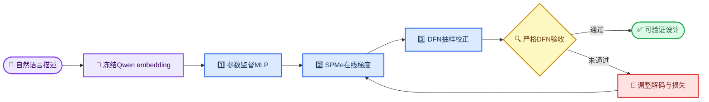
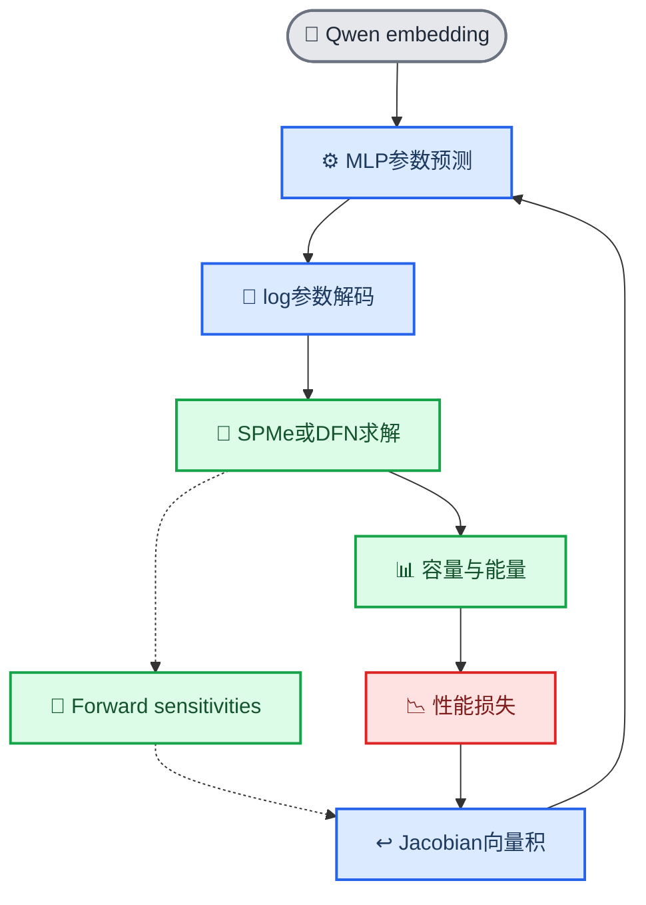

# Qwen–MLP–SPMe–DFN三阶段自然语言电池逆设计实验报告

_基于GradCell代码仓库、DeepSeek 2158条语言数据、服务器训练日志与DFN复算记录整理；更新日期：2026-09-23_

---

## 📋 摘要

本实验研究从自然语言电池描述直接生成可仿真的电池参数设计。系统首先使用冻结的本地Qwen3-8B将自然语言编码为语义向量，再由一个有界单输出多层感知机（MLP）预测七个电化学设计参数。训练被拆分为三个连续阶段：阶段一使用教师设计参数对MLP进行监督预训练；阶段二把MLP输出送入PyBaMM SPMe，通过1C、5C和6C在线仿真及forward sensitivities提供性能梯度；阶段三用少量DFN sensitivity进行高保真校正，并在未参与训练的测试集上执行无梯度严格DFN验收。

实验数据来自Chen2020 Regular Mode。2158条DeepSeek自然语言记录对应720个物理设计，按性能等价组和物理设计族进行严格划分，得到1726条训练记录、216条验证记录和216条测试记录，组泄漏和物理设计泄漏均为零。当前代码已经实现三阶段训练、checkpoint衔接、SPMe/DFN可微层、梯度质量检查、严格测试集验收以及应用级自然语言评测。

现有结果表明，阶段二的SPMe求解成功率达到100%，说明在线物理仿真链路可以稳定运行；但训练loss下降很小，并且216条测试预测的正极“孔隙率+活性材料体积分数”均约为1.001422，超过物理上限1。因此，当前阶段二checkpoint尚不能被称为原生结构可行模型。随后16条严格DFN复算因结构可行率为0而没有形成有效性能误差，阶段三最终验收尚未通过。旧版冻结代理模型实验曾在216条测试样本上实现DFN求解成功率100%，但八项指标在5%误差内同时达标的比例只有24.07%；这一结果只能作为旧基线，不能替代当前三阶段模型的最终结论。

## 🎯 实验目标与问题定义

实验的核心目标不是让语言模型直接生成任意JSON文本，而是学习一个可验证的逆设计映射：给定描述电池性能和应用特征的自然语言，预测一组电池结构与动力学参数，并通过物理仿真判断该设计是否具有相应的1C、5C和6C放电性能。

当前映射可写为：

\[
\text{description}
\xrightarrow{\text{Qwen3-8B}}
h
\xrightarrow{\text{MLP}}
\hat z
\xrightarrow{\text{decode}}
\hat x
\xrightarrow{\text{SPMe/DFN}}
\hat y,
\]

其中，\(h\)是冻结的语言embedding，\(\hat z\)是标准化log参数，\(\hat x\)是七维物理参数，\(\hat y\)是八维性能向量。模型需要同时解决三个问题：语言描述能否包含足以恢复设计的信息；预测参数能否保持结构可行；预测设计经高保真物理模型复算后能否接近描述对应的教师性能。



## 🧪 数据集构建与严格划分

### 训练数据来源

物理数据由PyBaMM参数集出发，对预先选定的电池参数进行Regular Mode或Extreme Mode扰动，再使用DFN仿真得到容量、能量和倍率保持率。DeepSeek根据这些结构化物理结果生成自然语言描述，形成“语言描述—教师设计—DFN性能”三元组。当前进入三阶段训练的2158条记录实际上全部来自Chen2020 Regular Mode，而不是五种参数集的混合数据，因此本实验只能证明单一参数集和单一扰动模式内的能力。

每个物理设计原则上对应三种语义一致但表达不同的DeepSeek描述。2158条记录对应720个物理设计，其中719个设计具有完整的三个语言版本，另有一个设计只保留了一条成功语言记录。语言多样化用于减弱固定模板依赖，但不能被解释为新增了2158个独立物理设计。

### 数据划分

数据由[`prepare_deepseek_topk_dataset.py`](../scripts/prepare_deepseek_topk_dataset.py)执行确定性分组划分。脚本以`inverse_ambiguity.equivalence_group_id`作为最高层分组单位，同时验证同一个`physical_design_id`不会跨越训练、验证和测试集合。这样可以避免同一物理设计的三种改写分别出现在训练集和测试集，从而造成语言层面的数据泄漏。

| 数据子集 | 语言记录数 | 物理设计数 | 性能等价组数 | 用途 |
| --- | ---: | ---: | ---: | --- |
| 训练集 | 1726 | 576 | 17 | 更新MLP参数 |
| 验证集 | 216 | 72 | 4 | 选择checkpoint与早停 |
| 测试集 | 216 | 72 | 4 | 最终独立评价 |
| 合计 | 2158 | 720 | 25 | 完整实验队列 |

划分manifest报告`group_leakage=0`和`physical_design_leakage=0`。这是本实验可信度的重要组成部分，因为随机按语言行切分会显著高估模型泛化能力。

### 七个设计参数

MLP输出的七个量与[`dfn_parameter.py`](../src/gradcell/benchmark/dfn_parameter.py)中的`PARAMETER_FIELDS`顺序严格一致。

| 索引 | 参数 | 物理作用 |
| ---: | --- | --- |
| 1 | Positive electrode porosity | 正极孔隙率 |
| 2 | Negative electrode porosity | 负极孔隙率 |
| 3 | Separator porosity | 隔膜孔隙率 |
| 4 | Positive electrode active material volume fraction | 正极活性材料体积分数 |
| 5 | Negative electrode active material volume fraction | 负极活性材料体积分数 |
| 6 | Positive particle diffusivity multiplier | 正极颗粒扩散率倍率 |
| 7 | Negative particle diffusivity multiplier | 负极颗粒扩散率倍率 |

前五项以实际体积分数进入PyBaMM，后两项是相对于参数集标称扩散率的倍率。电流由参考容量与C-rate计算，不属于MLP输出。

### 八个性能目标

SPMe和DFN使用相同的八维性能定义：

| 指标 | 含义 |
| --- | --- |
| `capacity_1c_ah` | 1C放电容量 |
| `energy_1c_wh` | 1C放电能量 |
| `capacity_5c_ah` | 5C放电容量 |
| `energy_5c_wh` | 5C放电能量 |
| `energy_retention_5c` | 5C能量相对1C能量的保持率 |
| `capacity_6c_ah` | 6C放电容量 |
| `energy_6c_wh` | 6C放电能量 |
| `energy_retention_6c` | 6C能量相对1C能量的保持率 |

训练读取七个参数倍率和八个性能目标后先取自然对数，再只用训练集统计均值和标准差完成标准化。参数边界取训练集标准化参数的逐维最小值和最大值，并向两侧各扩展0.05。验证集和测试集不参与均值、标准差或边界计算。

## 🏗️ 模型与代码架构

### 冻结Qwen语义编码器

[`extract_paper_explore_embeddings.py`](../scripts/extract_paper_explore_embeddings.py)使用本地Qwen3-8B读取`battery_description`，对有效token的最后一层hidden states执行masked mean pooling，生成固定长度embedding。模型使用`bfloat16`加载，调用`eval()`并设置`requires_grad_(False)`，因此三个训练阶段都不会更新Qwen参数。

冻结Qwen有三个直接结果。第一，训练显存主要用于MLP，不需要保存8B模型的反向图；第二，同一份embedding缓存可以被不同随机种子和不同物理阶段复用；第三，当前实验只能验证Qwen现有语义表示是否可被MLP利用，不能证明Qwen本体经过了电池领域微调。

### 有界单设计MLP

[`physics_guided.py`](../src/gradcell/language/physics_guided.py)中的`SingleDesignPhysicsMLP`由输入LayerNorm、线性层、SiLU、Dropout、两个残差块、末端LayerNorm和七维设计头组成。默认隐藏维度为512。网络输出不是直接的物理参数，而是标准化log参数：

\[
\hat z = c + r\tanh(f_\theta(h)),
\]

其中，\(c=(z_{\min}+z_{\max})/2\)，\(r=(z_{\max}-z_{\min})/2\)。`tanh`保证每一维输出位于训练范围扩展后的上下界内。

解码过程为：

\[
\ell = \hat z\odot\sigma_x+\mu_x,
\qquad
m=\exp(\ell),
\qquad
x=m\odot x_{\text{nominal}}.
\]

这里\(m\)是参数倍率，\(x_{\text{nominal}}\)是Chen2020标称参数。逐维有界并不自动保证正极和负极的耦合约束成立，即：

\[
\varepsilon_p+\phi_p\le 1,
\qquad
\varepsilon_n+\phi_n\le 1.
\]

这一点正是当前阶段二结果出现轻微越界的根本原因之一。

### PyBaMM可微物理层

[`direct_dfn.py`](../src/gradcell/language/direct_dfn.py)构造1C、5C和6C三个独立PyBaMM backend。训练时不使用硬电压截止计算容量，而是使用平滑门函数：

\[
g(V)=\operatorname{sigmoid}\left(\frac{V-V_{\text{cut}}}{T_g}\right),
\]

\[
Q=\frac{I}{3600}\int g(V(t))\,dt,
\qquad
E=\frac{1}{3600}\int I V(t)g(V(t))\,dt.
\]

默认软截止电压为2.5 V，门函数温度为0.02 V。平滑门使容量和能量对电压轨迹连续可微；2.0 V训练安全下限用于防止耗尽后的低电压区域导致IDA步长塌缩。

[`autograd_layer.py`](../src/gradcell/physics/autograd_layer.py)把PyBaMM返回的显式Jacobian封装为PyTorch自定义`autograd.Function`。后端前向返回轨迹\(y\)及其对物理输入\(x\)的Jacobian \(J=\partial y/\partial x\)，反向传播计算：

\[
\frac{\partial L}{\partial x}
=
\sum_{o,t}
\frac{\partial L}{\partial y_{o,t}}
J_{o,t,:}.
\]

PyBaMM本身没有可训练权重；它提供的是物理响应和梯度。真正被优化器更新的仍是MLP参数\(\theta\)。



## 1️⃣ 阶段一：设计参数监督预训练

### 训练目的

阶段一只学习“语言embedding到教师设计参数”的映射，不调用SPMe或DFN。其主要作用是把随机初始化MLP带入DFN数据分布附近，使下一阶段的物理求解从相对可信的初始区域开始。否则，随机网络容易生成极端参数，导致SPMe/DFN在训练初期频繁失败。

### 损失函数与更新范围

阶段一在标准化log参数空间使用Smooth-L1损失：

\[
L_{\text{design}}
=
\operatorname{SmoothL1}(\hat z,z^*).
\]

Qwen embedding已经离线计算并冻结，PyBaMM没有进入计算图，因此梯度路径只有：

\[
L_{\text{design}}\rightarrow\text{MLP}.
\]

默认配置为batch size 64、最多50个epoch、AdamW学习率\(3\times10^{-4}\)、weight decay \(10^{-4}\)、梯度裁剪1.0以及验证集耐心值8。验证Smooth-L1下降时保存`best_model.pt`。

### 代码设计

[`train_battery_description_stage1_supervised.py`](../scripts/train_battery_description_stage1_supervised.py)复用统一的`prepare_data()`，以确保三个阶段使用相同的任务顺序、标准化统计量、参数边界和数据hash。checkpoint保存MLP结构、权重、参数名、性能字段、标准化统计、embedding元数据、数据集路径和SHA-256。下一阶段会核对`dataset_sha256`和`model_config`，避免错误地加载来自其他数据或其他网络结构的权重。

阶段一产生以下文件：

| 文件 | 内容 |
| --- | --- |
| `best_model.pt` | 验证集最佳MLP权重及完整元数据 |
| `history.json` | 每个epoch的训练Smooth-L1、验证MSE和验证Smooth-L1 |
| `metrics.json` | 最佳checkpoint的验证集和测试集参数误差 |
| `stage1_training_curves.png/pdf` | 训练曲线与泛化间隔图 |

### 阶段一效果

阶段一已经证明训练链路能够从Qwen embedding学习七维教师参数，并为物理阶段提供可用初值。它的优势是快速、稳定且不依赖PyBaMM在线求解。然而，阶段一的参数loss下降不等价于容量、能量或倍率性能满足要求。它也无法解决逆设计的一对多性：多个不同结构可能产生近似性能，而单输出Smooth-L1倾向于学习平均参数。

当前对话和本地仓库没有保存本次三阶段运行的`stage1_design_supervision/metrics.json`具体数值，因此本报告不虚构阶段一MSE或最佳epoch。正式论文或答辩材料应从服务器复制该文件后补充精确结果。

## 2️⃣ 阶段二：SPMe在线物理梯度训练

### 训练目的

阶段二从阶段一最佳checkpoint继续训练，把MLP输出的实际参数分别送入1C、5C和6C SPMe。SPMe输出的电压轨迹被转换为八项性能，再与原始DFN数据中的性能标签比较。这样，MLP不仅模仿教师参数，还接收到“参数变化如何影响性能”的方向性梯度。

### 组合损失

总损失由四项构成：

\[
L=
\lambda_dL_{\text{design}}
+\lambda_pL_{\text{performance}}
+\lambda_fL_{\text{feasibility}}
+\lambda_sL_{\text{support}}.
\]

性能项先对SPMe预测的正值性能取log，再使用训练集统计量标准化：

\[
L_{\text{performance}}
=
\operatorname{SmoothL1}
\left(
\frac{\log\hat y-\mu_y}{\sigma_y},
\frac{\log y^*-\mu_y}{\sigma_y}
\right).
\]

结构可行性项为：

\[
L_{\text{feasibility}}
=
\mathbb E\left[
\operatorname{ReLU}(\varepsilon_p+\phi_p-1)^2
+
\operatorname{ReLU}(\varepsilon_n+\phi_n-1)^2
\right].
\]

支持集约束用于匹配Regular Mode主要改变少数参数的特点。代码计算log倍率平方和，减去最大单维平方：

\[
L_{\text{support}}
=
\mathbb E\left[
\sum_j \ell_j^2-\max_j\ell_j^2
\right].
\]

默认权重为\(\lambda_d=0.25\)、\(\lambda_p=1\)、\(\lambda_f=10\)、\(\lambda_s=1\)。默认batch size为2、学习率为\(10^{-4}\)，最多训练10个epoch。第一次有效反向传播后，代码记录`gradient_qa`，要求MLP梯度范数有限且大于零，以证明PyBaMM sensitivity确实到达MLP。

### 已观察到的训练结果

服务器提供的前四个epoch如下。表中数值来自实际日志，而非本地重新计算。

| Epoch | 训练总loss | 训练设计loss | 训练性能loss | 验证总loss | 验证性能loss | 训练SPMe成功率 |
| ---: | ---: | ---: | ---: | ---: | ---: | ---: |
| 1 | 10.93482 | 1.11595 | 10.60569 | 10.68932 | 10.43757 | 100% |
| 2 | 10.90423 | 1.10930 | 10.59567 | 10.69280 | 10.41955 | 100% |
| 3 | 10.89870 | 1.10606 | 10.59521 | 10.68600 | 10.43421 | 100% |
| 4 | 10.89738 | 1.10478 | 10.59520 | 10.68406 | 10.43163 | 100% |

从epoch 1到epoch 4，训练总loss仅下降约0.34%，验证总loss仅下降约0.05%。SPMe成功率100%说明求解链路稳定，但性能loss长期维持在约10.6，说明当前优化没有显著改善目标性能。训练每个epoch的SPMe累计求解时间约1532–1566秒，而验证约32–33秒，表明主要瓶颈在CPU侧PyBaMM sensitivity，而不是A100上的MLP。

### 结构可行性问题

对216条预测进行检查后，结果为：正极孔隙率与正极活性材料体积分数之和最小值约1.00142219、均值约1.00142226、最大值约1.00142227，216条全部越界；负极对应和约0.99831–0.99861，没有越界。因此MLP收敛到了一个几乎固定的正极边界外解。

该现象与loss尺度直接相关。越界量约为0.001422，平方后约为\(2.0\times10^{-6}\)，即使乘以可行性权重10，对总loss的贡献也只有约\(2.0\times10^{-5}\)。与约10.6的性能loss相比，这一惩罚几乎可以忽略。训练日志中`train_feasibility`约为\(2\times10^{-6}\)，恰好验证了这一判断。

因此，阶段二目前实现了“可微SPMe训练链路”，但没有实现“MLP原始输出严格结构可行”。应用评测脚本加入了按比例投影，把电极体积分数和修正到\(1-10^{-4}\)后再进入SPMe；该投影可以保障仿真输入合法，但只能视为推理期安全层，不能把投影后的可行率当成MLP本身的可行率。

## 3️⃣ 阶段三：DFN抽样校正与严格验收

### 训练目的与数据隔离

阶段三包括“抽样校正”和“最终验收”两个不同步骤。校正阶段从训练集抽取极少量样本，用阶段二权重初始化MLP，以较低学习率执行DFN sensitivity训练；验证集抽样用于checkpoint选择。测试集不参与权重更新或模型选择。

最终验收由[`audit_battery_description_stage3_dfn.py`](../scripts/audit_battery_description_stage3_dfn.py)完成。它从未参与训练的测试集按固定种子抽样，设置`calculate_sensitivities=False`，只做DFN前向复算。默认要求DFN成功率至少95%，并要求至少20%的样本在八项性能上同时满足10%相对误差。

### 为什么阶段三必须抽样

服务器曾测得单个样本完成1C、5C和6C三个DFN sensitivity求解约需1175.9秒。按这一速度，直接对1726条训练记录进行多epoch DFN在线训练在当前CPU配置下不可行。三阶段设计因此用SPMe承担大部分梯度更新，只把DFN用于少量高保真校正和最终验收。

### 数值求解器观察

使用标称Chen2020参数测试DFN时，`rtol=1e-6`、`atol=1e-8`和默认短电流ramp曾在\(t=0\)触发IDA error test failure，1C、5C和6C均失败。把配置调整为`rtol=1e-4`、`atol=1e-6`并将`current_ramp_time_s`设为60秒后，同一标称参数成功求解，得到以下性能：

| 指标 | 数值 |
| --- | ---: |
| 1C容量 | 5.0235 Ah |
| 1C能量 | 17.6441 Wh |
| 5C容量 | 1.0232 Ah |
| 5C能量 | 3.6170 Wh |
| 5C能量保持率 | 0.2050 |
| 6C容量 | 0.9250 Ah |
| 6C能量 | 3.3148 Wh |
| 6C能量保持率 | 0.1879 |

这说明DFN失败并不总是设计本身无效，也可能来自初始电流阶跃和过严容差。训练校正与最终严格验收应分别报告求解配置，不能把“放宽容差后的稳定求解”和“严格容差科学复核”混为一谈。

### 当前阶段三结果

对阶段二`test_predictions.jsonl`抽取16条执行严格DFN验证时，报告显示结构可行率0%、DFN成功率0%、八指标联合通过率0%，所有逐字段MAPE均为`null`。结合216条结构审计可知，主要原因是正极体积分数和超过1，验证器在进入有效DFN性能比较之前即判定设计不可行。

因此，当前三阶段实验的最终状态应写为：训练基础设施已经完成，SPMe梯度链路已经验证，但阶段三高保真验收未通过。不能把当前阶段二checkpoint描述为已经生成“满足需求的最终设计”。

## 📊 旧基线与当前三阶段结果的区别

在三阶段方案之前，仓库还运行过“冻结Qwen embedding → MLP → 冻结DFN性能代理模型”的物理引导实验。该旧基线的216条独立测试记录经DFN复算后，结构可行率和DFN成功率均为100%，但八项指标在5%相对误差内同时达标的比例为24.07%。各项MAPE如下：

| 性能指标 | MAPE | 中位APE | P90 APE |
| --- | ---: | ---: | ---: |
| 1C容量 | 4.59% | 4.28% | 8.80% |
| 1C能量 | 4.26% | 3.98% | 7.84% |
| 5C容量 | 5.53% | 4.64% | 11.26% |
| 5C能量 | 5.58% | 4.75% | 11.34% |
| 5C能量保持率 | 9.04% | 8.08% | 16.89% |
| 6C容量 | 3.44% | 2.57% | 7.52% |
| 6C能量 | 3.66% | 2.95% | 7.50% |
| 6C能量保持率 | 7.18% | 6.19% | 13.41% |

全部样本和指标的总体平均绝对百分比误差约为5.41%，中位数约为4.46%，P90约为10.81%。5C和6C能量保持率是主要误差来源。该结果证明旧模型能够生成可进入DFN的设计，但不能证明当前SPMe在线训练checkpoint具有相同表现，也不能证明模型满足产品级应用需求。

| 对比项 | 旧冻结代理基线 | 当前三阶段方案 |
| --- | --- | --- |
| 训练性能梯度 | 冻结神经代理模型 | PyBaMM SPMe/DFN sensitivity |
| 训练时真实求解PyBaMM | 否 | 是 |
| 结构可行率 | 测试复算100% | 当前阶段二原始输出0% |
| DFN成功率 | 216条中100% | 当前16条验收0% |
| 主要结论 | 可行但性能联合命中率偏低 | 物理梯度链已通，训练目标仍需修正 |

## 🔬 应用级自然语言测试

[`generate_application_battery_prompt_dataset.py`](../scripts/generate_application_battery_prompt_dataset.py)使用DeepSeek生成应用级用户需求，例如70 Ah LFP/石墨软包、尺寸和质量上限、循环寿命、安全、成本和低温要求。默认32个结构化规格，每个规格生成三种语义一致的描述，共96条。这96条是域外能力测试集，不参与三阶段训练。

[`evaluate_application_requirements_qwen_mlp_spme_deepseek.py`](../scripts/evaluate_application_requirements_qwen_mlp_spme_deepseek.py)执行以下推理链：自然语言由本地Qwen生成embedding，阶段二MLP生成七参数设计，必要时对电极体积分数组合做最小比例投影，SPMe计算1C、5C和6C性能，最后把原始需求、设计和仿真结果交给DeepSeek逐项评判。

DeepSeek评判被限制为`satisfied`、`not_satisfied`和`not_evaluable`三种逐项状态。SPMe只验证Chen2020基准单体在给定条件下的短时放电性能，无法直接验证70 Ah产品级容量、LFP化学体系、软包尺寸、质量、3000次循环、安全、成本或低温性能。这些没有直接证据的要求必须判为`not_evaluable`，不能依靠语言模型常识判为满足。

截至本报告整理时，服务器上的应用级一条样本测试尚未形成`report.json`。启动脚本曾因输入文件检查失败而静默退出，因此应用级DeepSeek最终判定没有可报告的数值。该部分应在成功生成96条需求并完成推理后，再从`results/application_requirements_spme_deepseek/report.json`补充。

## 💻 代码组织与职责

| 文件 | 主要职责 |
| --- | --- |
| [`build_multiset_dfn_language_dataset.py`](../scripts/build_multiset_dfn_language_dataset.py) | 构建DFN物理档案、调用DeepSeek生成语言、断点续跑和歧义审计 |
| [`prepare_deepseek_topk_dataset.py`](../scripts/prepare_deepseek_topk_dataset.py) | 筛选2158条成功记录并执行严格分组划分 |
| [`extract_paper_explore_embeddings.py`](../scripts/extract_paper_explore_embeddings.py) | 从本地Qwen提取冻结embedding并缓存 |
| [`physics_guided.py`](../src/gradcell/language/physics_guided.py) | 定义有界残差MLP和旧DFN代理模型 |
| [`train_battery_description_stage1_supervised.py`](../scripts/train_battery_description_stage1_supervised.py) | 阶段一参数监督训练 |
| [`direct_dfn.py`](../src/gradcell/language/direct_dfn.py) | 统一SPMe/DFN三倍率性能层和软截止积分 |
| [`autograd_layer.py`](../src/gradcell/physics/autograd_layer.py) | 将PyBaMM Jacobian接入PyTorch反向传播 |
| [`train_battery_description_direct_dfn.py`](../scripts/train_battery_description_direct_dfn.py) | 阶段二SPMe训练和阶段三DFN抽样校正 |
| [`audit_battery_description_stage3_dfn.py`](../scripts/audit_battery_description_stage3_dfn.py) | 未触碰测试集上的无梯度DFN最终验收 |
| [`run_deepseek_2158_three_stage_server.sh`](../scripts/run_deepseek_2158_three_stage_server.sh) | A100服务器三阶段串联运行 |
| [`generate_application_battery_prompt_dataset.py`](../scripts/generate_application_battery_prompt_dataset.py) | 生成应用级DeepSeek自然语言需求 |
| [`evaluate_application_requirements_qwen_mlp_spme_deepseek.py`](../scripts/evaluate_application_requirements_qwen_mlp_spme_deepseek.py) | Qwen+MLP设计、SPMe复算与DeepSeek验收 |

代码设计强调可复现性和阶段隔离。数据与embedding通过SHA-256绑定；所有split和抽样使用固定seed；checkpoint保存模型结构、标准化统计和物理配置；测试集不用于训练；JSONL写入使用临时文件替换以降低中断损坏风险；DeepSeek输出支持断点续跑，避免重复API消费。

## 🚀 A100复现实验流程

### 三阶段训练

```bash
CUDA_DEVICE=2 \
QWEN_MODEL_NAME="$PWD/models/Qwen3-8B" \
THREE_STAGE_SEEDS="7" \
STAGE1_EPOCHS=50 \
STAGE1_BATCH_SIZE=64 \
STAGE2_EPOCHS=10 \
STAGE2_BATCH_SIZE=2 \
STAGE3_CORRECTION_TRAIN_RECORDS=4 \
STAGE3_CORRECTION_VALIDATION_RECORDS=2 \
STAGE3_CORRECTION_TEST_RECORDS=2 \
STAGE3_AUDIT_RECORDS=16 \
bash scripts/run_deepseek_2158_three_stage_server.sh
```

A100主要负责Qwen embedding和MLP。PyBaMM IDAKLU及forward sensitivities主要消耗CPU，因此GPU利用率低并不代表训练停止。观察训练时应同时使用`nvidia-smi`、CPU利用率和`history.json`更新时间。

### 应用级需求生成

```bash
python scripts/generate_application_battery_prompt_dataset.py \
  --output data/application_prompts/application_battery_prompts_deepseek_s7.jsonl \
  --text-output data/application_prompts/application_battery_prompts_deepseek_s7.txt \
  --spec-count 32 \
  --variants-per-spec 3 \
  --require-success \
  --seed 7
```

生成后应有96行：

```bash
wc -l data/application_prompts/application_battery_prompts_deepseek_s7.jsonl
```

### 应用级一条样本测试

```bash
CUDA_DEVICE=3 \
QWEN_MODEL_NAME="$PWD/models/Qwen3-8B" \
APPLICATION_PROMPT_DATA="$PWD/data/application_prompts/application_battery_prompts_deepseek_s7.jsonl" \
DESIGN_CHECKPOINT="$PWD/results/deepseek_2158_three_stage/seed_7/stage2_spme_online/best_model.pt" \
APPLICATION_EVAL_OUTPUT_DIR="$PWD/results/application_requirements_spme_deepseek_test" \
APPLICATION_EVAL_MAX_RECORDS=1 \
PYTHONUNBUFFERED=1 \
bash scripts/run_application_requirements_spme_deepseek_server.sh
```

运行前必须确认需求文件、本地Qwen的`config.json`和阶段二checkpoint均存在且非空。不要使用`bash -x`启动包含`.env`的脚本，否则API密钥会被打印到终端日志。

## ⚠️ 当前结论与局限性

本实验已经完成从冻结语言表示到参数预测、再到PyBaMM在线物理梯度的核心工程闭环。严格分组划分、数据hash检查、显式Jacobian反向传播和独立测试集验收使得实验设计比普通的随机行划分和代理模型评价更可信。

但从现有结果看，三阶段模型尚未完成最终验收。阶段二性能loss几乎不下降，结构可行性惩罚在总loss中的实际量级过小，导致所有测试预测在正极体积分数组合上轻微越界。阶段三因而无法形成有效DFN性能统计。当前最准确的结论是“方法链路可运行，SPMe sensitivity能够回传到MLP，但模型输出与最终DFN验收仍需改进”，而不是“已经能够根据任意自然语言生成满足全部需求的电池”。

此外，训练数据只覆盖Chen2020 Regular Mode，语言描述主要由同一个DeepSeek模型生成，目标只包含短时1C/5C/6C放电性能。实验没有训练循环寿命、热安全、尺寸、质量、成本、低温或化学体系切换能力。应用级自然语言中的这些要求只能用于能力边界测试，不能由当前SPMe结果直接验收。

## 🔧 下一轮实验建议

下一轮训练的首要修改应是把电极体积分数耦合约束放入模型解码器，而不是继续依赖平方惩罚。例如，分别对正负极输出三个logits，通过softmax分配孔隙率、活性材料比例和剩余惰性相，从结构上保证三者为正且总和为1。这样可以消除目前约0.001422的系统性越界，并保持端到端可微。

第二，应重新平衡损失。当前标准化性能Smooth-L1约为10.6，而加权可行性项约为\(2\times10^{-5}\)，尺度相差约五个数量级。可以采用分阶段权重调度、归一化多任务损失或增广拉格朗日约束，并单独记录每一项加权后的loss贡献。单纯把`feasibility_weight`从10改到更大只能缓解问题，不如硬可行解码可靠。

第三，应先对阶段一和阶段二分别建立完整消融：只用设计监督、设计监督加SPMe性能、加入支持约束、加入硬可行解码。每个配置至少运行seed 7、17和27，并报告参数误差、SPMe成功率、原始结构可行率、八项性能MAPE以及DFN联合通过率。只有在阶段二原始结构可行率接近100%后，才值得扩大DFN校正样本数。

第四，DFN校正需要采用经过标称参数验证的稳定求解配置。建议把60秒电流ramp作为校正阶段候选设置，同时保留更严格配置做最终科学验收，并报告两者的性能偏差。求解器失败样本必须区分“结构无效”“数值失败”和“物理截止”，避免把所有失败归为模型设计错误。

最后，数据集应逐步加入其他PyBaMM parameter sets、Extreme Mode、人工或其他语言模型生成的描述，以及热、老化和结构尺度模型。在此之前，论文结论应严格限定为Chen2020 Regular Mode下的七参数、短时放电逆设计。

## ✅ 实验状态总结

| 环节 | 当前状态 | 证据与判断 |
| --- | --- | --- |
| DeepSeek 2158条数据筛选 | 已完成 | 2158条、720个物理设计 |
| 严格训练/验证/测试划分 | 已完成 | 1726/216/216，零组泄漏 |
| 本地Qwen embedding | 已完成 | 冻结、离线缓存、mean pooling |
| 阶段一参数监督 | 已实现并运行 | 具体最终metrics需从服务器补入 |
| 阶段二SPMe在线梯度 | 已运行 | 求解成功率100%，loss改善很小 |
| 阶段二原始结构可行性 | 未通过 | 正极216/216轻微越界 |
| 阶段三DFN抽样校正 | 代码已实现 | 高计算成本，最终效果尚无有效报告 |
| 阶段三严格DFN验收 | 未通过 | 16条结构可行率和DFN成功率均为0 |
| 旧代理模型DFN基线 | 已完成 | 216条成功率100%，5%联合通过率24.07% |
| 应用级96条需求生成 | 脚本已完成 | 服务器实际文件需确认96行 |
| 应用级SPMe+DeepSeek评判 | 尚未形成结果 | 暂无最终`report.json` |

总体而言，本次实验最大的成果是验证了“自然语言embedding—设计MLP—真实PyBaMM sensitivity”的端到端工程可行性，并建立了严格的数据隔离与高保真验收框架。当前最关键的问题已经从“能否把仿真器接入训练”转变为“如何用硬约束解码和合理loss尺度，使MLP原始输出稳定落在物理可行域并真正改善DFN性能”。

## 🔗 仓库内参考文档

- [自然语言电池设计三阶段训练](./自然语言电池设计三阶段训练.md)
- [DeepSeek 2158严格划分与Top-K训练](./DeepSeek2158_严格划分与TopK训练.md)
- [DeepSeek 2158单设计物理引导训练](./DeepSeek2158_单设计物理引导训练.md)
- [自然语言设计直接DFN梯度训练](./自然语言设计直接DFN梯度训练.md)
- [应用级自然语言测试集与模型测试](./应用级自然语言测试集与模型测试.md)
- [自然语言需求到SPMe仿真与DeepSeek验收](./自然语言需求_Qwen_MLP_SPMe_DeepSeek评测.md)

---

_本报告只陈述仓库代码和已经提供的服务器日志能够支持的结论。阶段一最终数值、阶段三校正结果及应用级DeepSeek评判结果需要在对应输出文件生成后再补充。_
